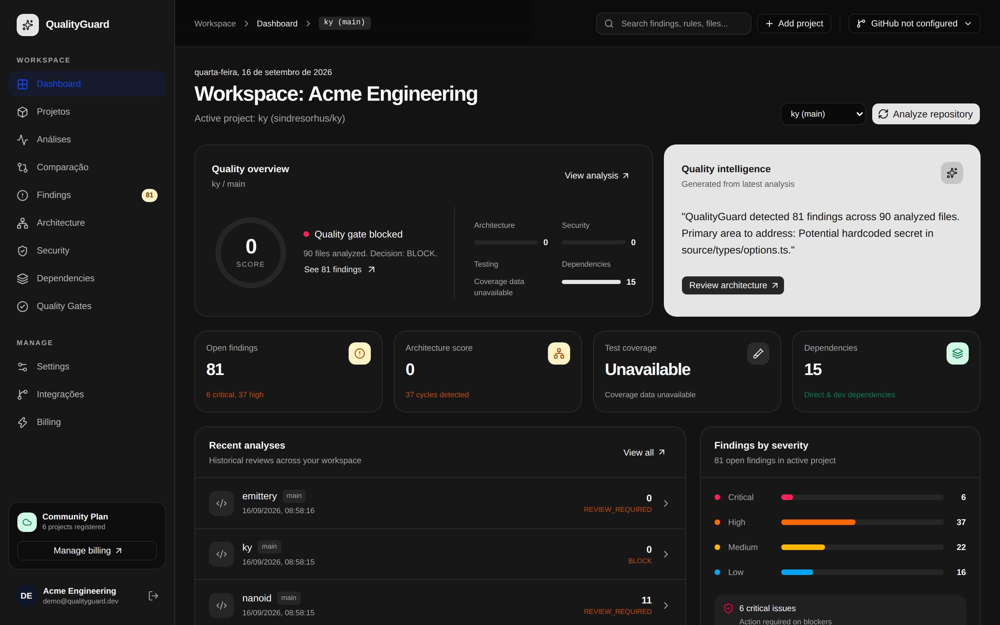
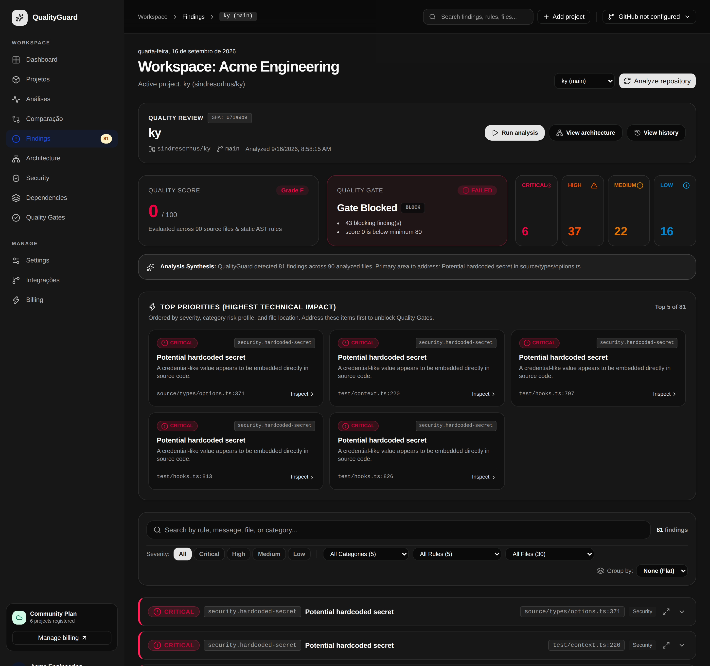
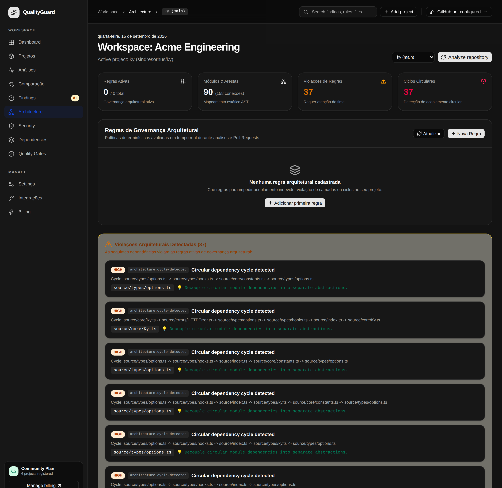
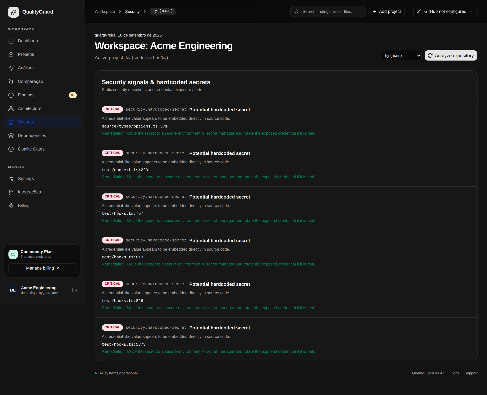
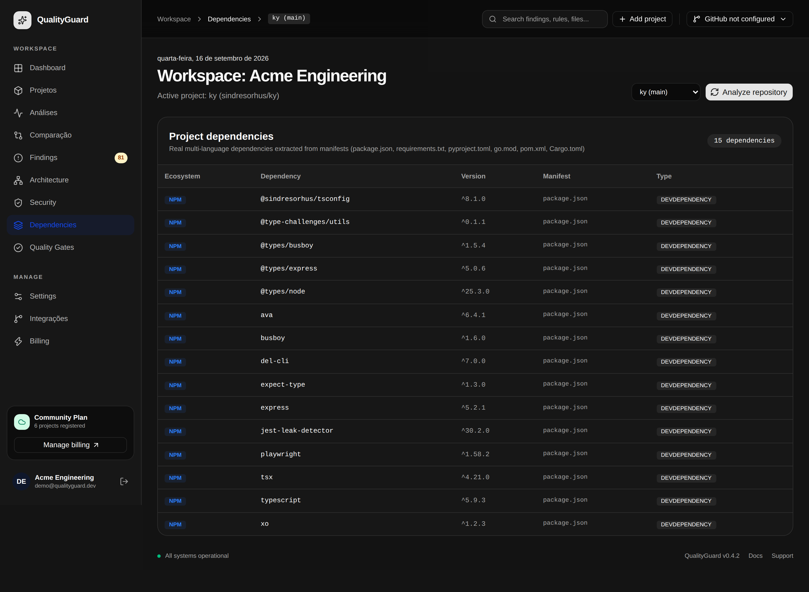
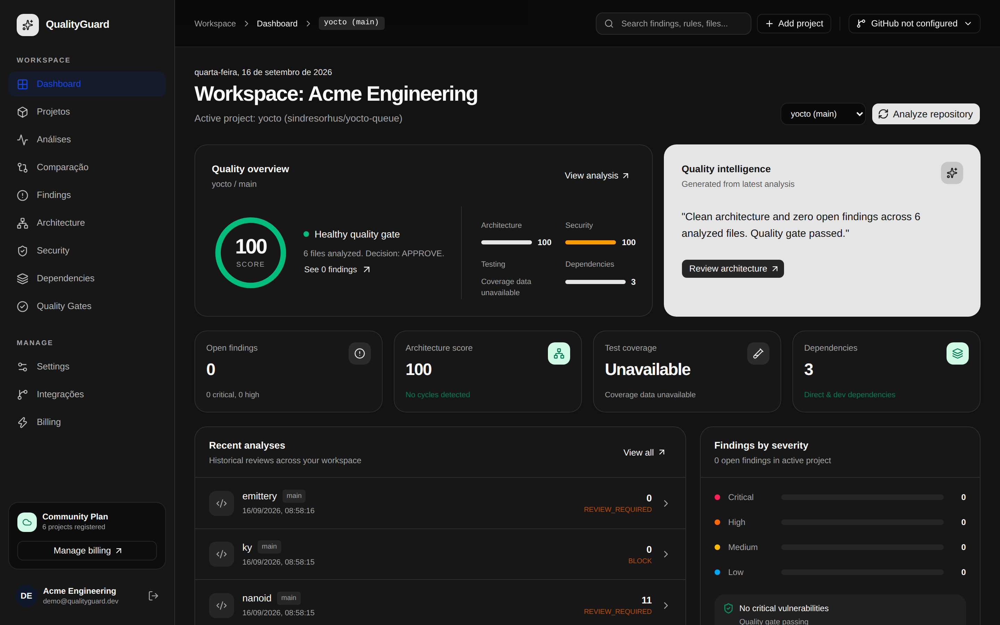
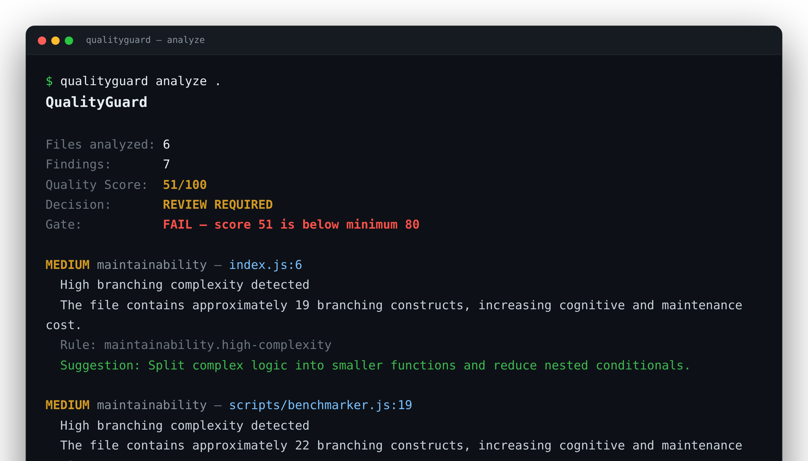
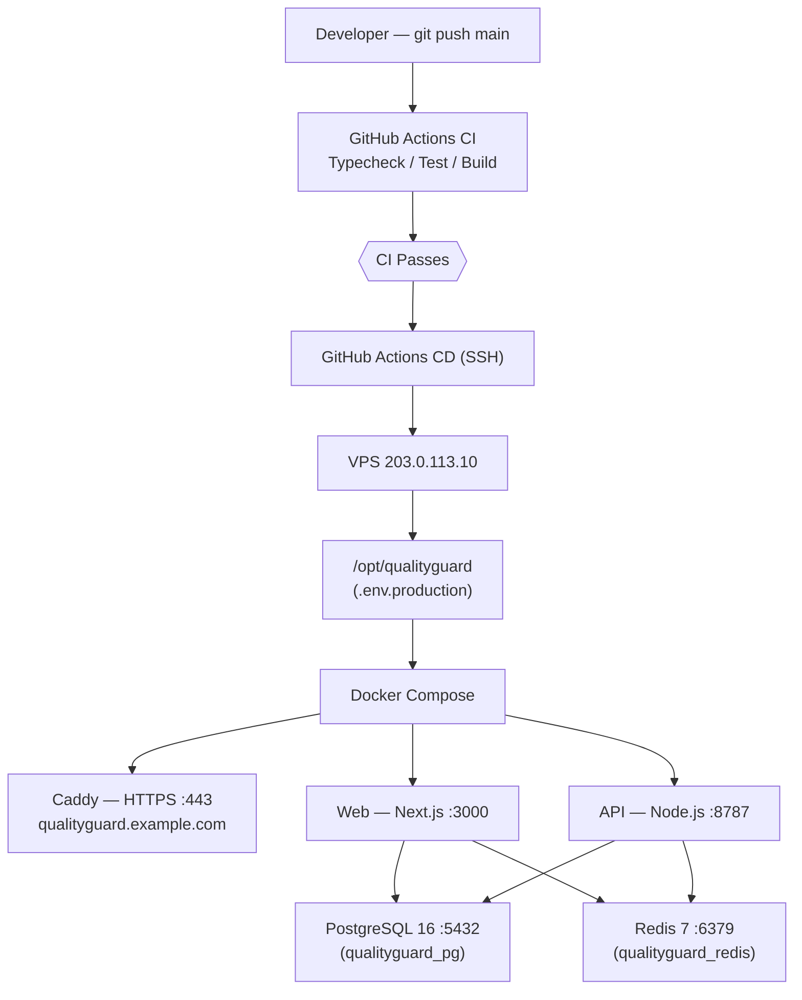
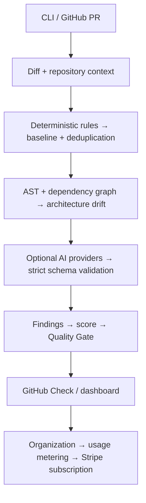

# QualityGuard

[](https://github.com/GiovaniRodrigo/qualityguard/actions/workflows/ci.yml)
[](https://github.com/GiovaniRodrigo/qualityguard/actions/workflows/security.yml)
[](./LICENSE)

> AI-powered software quality and architecture governance for teams shipping code with AI.

**Can this change safely enter the current architecture?**

QualityGuard combines deterministic analysis, architecture intelligence and optional AI review into an executable quality-control layer for software teams.

<p align="center">
  
</p>

<p align="center">
  <em>The workspace dashboard: quality score, gate decision, architecture &amp; security signals, severity breakdown and AI-generated insight — for every analyzed repository.</em>
</p>

---

## Screenshots

<table>
  <tr>
    <td width="50%" valign="top">
      <br>
      <sub><b>Findings command center</b> — quality review, gate status, severity counters, prioritized findings and full-text search across every rule detection.</sub>
    </td>
    <td width="50%" valign="top">
      <br>
      <sub><b>Architecture governance</b> — module/edge graph from the TypeScript AST, custom policy rules and circular-dependency detection with remediation hints.</sub>
    </td>
  </tr>
  <tr>
    <td width="50%" valign="top">
      <br>
      <sub><b>Security signals</b> — static credential-exposure detections with file/line locations and remediation guidance.</sub>
    </td>
    <td width="50%" valign="top">
      <br>
      <sub><b>Dependency inventory</b> — multi-language dependencies extracted from manifests (<code>package.json</code>, <code>requirements.txt</code>, <code>pyproject.toml</code>, <code>go.mod</code>, <code>pom.xml</code>, <code>Cargo.toml</code>).</sub>
    </td>
  </tr>
  <tr>
    <td width="50%" valign="top">
      <br>
      <sub><b>Passing quality gate</b> — a clean repository with zero open findings and a healthy, approved gate.</sub>
    </td>
    <td width="50%" valign="top">
      <br>
      <sub><b>CLI</b> — <code>qualityguard analyze</code> prints score, gate decision and every finding with rule id and suggested fix, ready for CI.</sub>
    </td>
  </tr>
</table>

> Screenshots use public open-source repositories as sample projects; the workspace and organization shown are illustrative.

---

## Architecture & Production Flow



---

## Implemented Product Path



---

## Capabilities

### Developer / Engine
- Git diff and staged analysis
- YAML policy configuration
- Enable/disable rules and severity overrides
- Stable finding fingerprints and baseline suppression
- Quality Gate with minimum score and blocking severities
- Strict Zod finding validation
- Architecture dependency graph and cycle detection
- TypeScript AST extraction
- Architecture policy DSL and drift detection

### AI Governance
- Provider abstraction
- OpenAI, Gemini, Anthropic and Ollama adapters
- Context-aware review prompt
- JSON-only finding contract
- Schema validation before findings reach the product domain

### GitHub Integration
- Signed webhook verification
- GitHub App JWT and installation token flow
- Pull request event filtering
- Pull request diff retrieval
- Deterministic QualityGuard Check Run publishing
- PR summary comment client

### Commercial Platform & Ops
- Authentication foundation with production secret enforcement
- Organizations and projects
- PostgreSQL persistence and automatic initial migration
- Usage metering and plan limits
- Team policies
- Audit trail
- Dashboard/pricing surface
- Stripe customer creation & Checkout subscriptions
- Stripe Billing Portal & signed idempotent webhooks
- Rate limiting and request size protection
- Hardened multi-stage Docker images running unprivileged users
- Self-hosted PostgreSQL/Redis/API/web Docker Compose stack
- Caddy HTTPS reverse proxy with automated TLS
- Automated backup cron with 14-day retention
- CI/CD with automated rollback and comprehensive smoke testing suite

---

## Local Development Quickstart

### Prerequisites
- Node.js >= 22
- pnpm 10.15.0+
- Docker & Docker Compose

### Setup & Run
```bash
# 1. Clone repository
git clone https://github.com/GiovaniRodrigo/qualityguard.git
cd qualityguard

# 2. Install workspace dependencies
pnpm install

# 3. Copy local environment variables
cp .env.example .env

# 4. Run full test suite & build
pnpm test
pnpm build

# 5. (Optional) Run local stack with Docker Compose
docker compose up -d
```

---

## CLI Usage

```bash
# Analyze full repository
qualityguard analyze .

# Analyze git diff only
qualityguard analyze . --diff

# Analyze staged git changes
qualityguard analyze . --staged

# Execute quality gate check
qualityguard check . --diff

# Generate or update baseline
qualityguard baseline .
```

---

## Production & Operations Documentation

- [VPS Deployment Guide](docs/production/VPS-DEPLOYMENT.md): Initial server bootstrap, DNS, Docker setup, and environment configuration.
- [Operations Runbook](docs/production/OPERATIONS.md): Daily operations, service logs, health monitoring, backup inspection, and secret rotation.
- [Rollback Strategy](docs/production/ROLLBACK.md): Automated CI/CD rollback mechanics and manual recovery procedures.
- [Disaster Recovery Plan](docs/production/DISASTER-RECOVERY.md): Backup validation, database restoration, and bare-metal server provisioning.
- [Billing & Stripe Configuration](docs/commercial/BILLING.md): Stripe webhooks, products, and checkout setup.
- [Architecture Overview](docs/architecture/ARCHITECTURE.md): Monorepo workspace architecture and engine structure.

---

## Product Roadmap

See [ROADMAP.md](ROADMAP.md) for product evolution and the open-source / cloud
boundary.

---

## Open Source vs. Cloud

QualityGuard's **Open Source Core** (this repository, AGPL-3.0) is a fully
functional quality and architecture engine: analyzer, architecture
intelligence, AI adapters, CLI, API, web app, and GitHub integration. It runs
end-to-end locally and self-hosted with no proprietary dependency.

**Cloud / commercial** concerns — managed hosting, billing operations, and
enterprise governance — are documented as a separate boundary in
[ROADMAP.md](ROADMAP.md) and [docs/FEATURE_MATRIX.md](docs/FEATURE_MATRIX.md).

---

## Contributing

Contributions are welcome! Please read:

- [CONTRIBUTING.md](CONTRIBUTING.md) — setup, workflow, testing, and PR process
- [CODE_OF_CONDUCT.md](CODE_OF_CONDUCT.md) — community expectations
- [SECURITY.md](SECURITY.md) — how to report vulnerabilities privately

A good first contribution is a new analyzer rule in `packages/analyzer` or a
documentation improvement.

---

## License

QualityGuard is licensed under the **GNU Affero General Public License v3.0**
(AGPL-3.0-only). See [LICENSE](LICENSE) for the full text.

The AGPL requires that if you run a modified version of QualityGuard as a network
service, you must make the corresponding source code available to its users. For
commercial licensing inquiries, contact the maintainers.