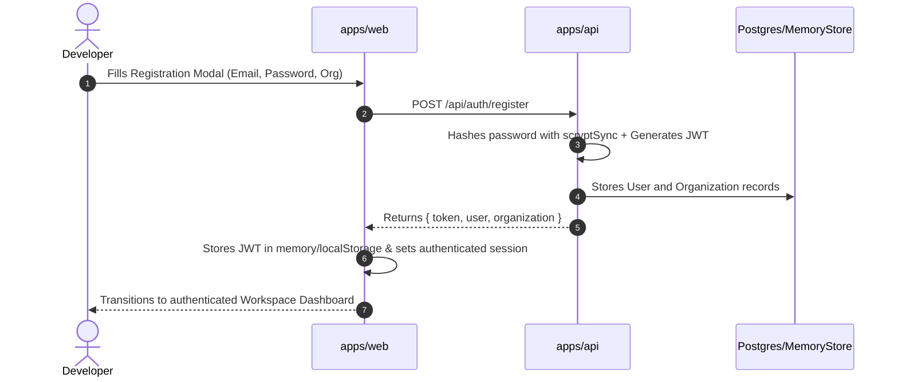
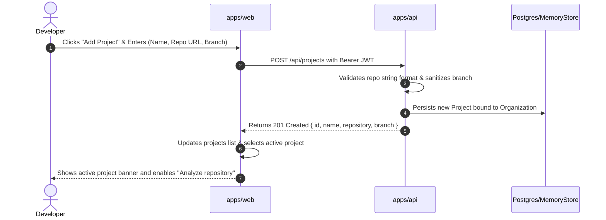
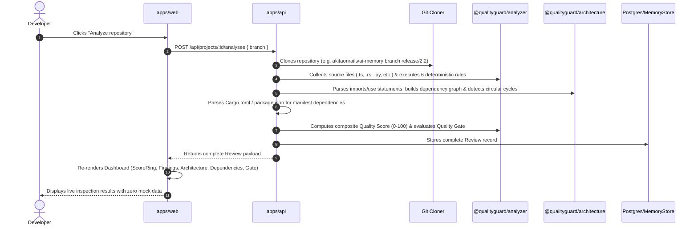
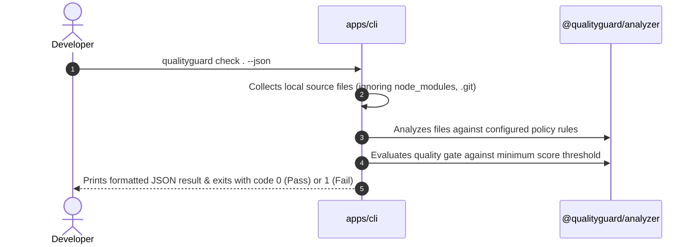

# QualityGuard — Core User Journeys & Verification Pipeline

This document outlines the core end-to-end user journeys supported by QualityGuard, detailing every step across UI, API, Domain, Service, Persistence, and Automated Tests.

---

## Journey 1: User Registration & Authentication

- **UI**: `apps/web/app/page.tsx` (`AuthModal`, `register()`, `login()`)
- **API**: `POST /api/auth/register`, `POST /api/auth/login`, `GET /api/me`
- **Domain**: `User`, `Organization`
- **Service**: `apps/api/src/auth.ts` (`hashPassword`, `verifyPassword`, `signToken`, `verifyToken`)
- **Persistence**: `store.createUser()`, `store.createOrganization()`
- **Tests**: `apps/api/src/auth.test.ts`, `apps/web/lib/api/api.test.ts`
- **Status**: **VERIFIED (PASS)**

---

## Journey 2: Project Creation & Repository Binding

- **UI**: `apps/web/app/page.tsx` (`Add Project Modal`, `createProject()`)
- **API**: `POST /api/projects`, `GET /api/projects`
- **Domain**: `Project`
- **Service**: `apps/api/src/server.ts`
- **Persistence**: `store.createProject()`, `store.listProjects()`
- **Tests**: `apps/web/lib/api/api.test.ts`, `apps/api/src/e2e.test.ts`
- **Status**: **VERIFIED (PASS)**

---

## Journey 3: Real Repository Analysis Execution & Quality Gate

- **UI**: `apps/web/app/page.tsx` (`handleRunAnalysis`, ScoreRing, MetricCards)
- **API**: `POST /api/projects/:id/analyses`
- **Domain**: `ReviewResult`, `Finding`, `Severity`, `ReviewDecision`, `ArchitectureGraph`
- **Service**: `apps/api/src/analysis.ts` (`runRepositoryAnalysis()`)
- **Persistence**: `store.createReview()`, `store.getLatestReviewByProject()`
- **Tests**: `apps/api/src/e2e.test.ts` (tested with real `akitaonrails/ai-memory`), `packages/analyzer/src/analyzer.test.ts`
- **Status**: **VERIFIED (PASS)**

---

## Journey 4: CLI Local Scanning (`qualityguard`)

- **CLI**: `apps/cli/src/index.ts`
- **Domain**: `ReviewResult`, `Finding`
- **Service**: `apps/cli/src/index.ts` (`runAnalysis()`, `collectFiles()`)
- **Persistence**: `.qualityguard-baseline.json` (optional baseline)
- **Tests**: `apps/cli/src/cli.test.ts`, `apps/cli/src/git.test.ts`
- **Status**: **VERIFIED (PASS)**
