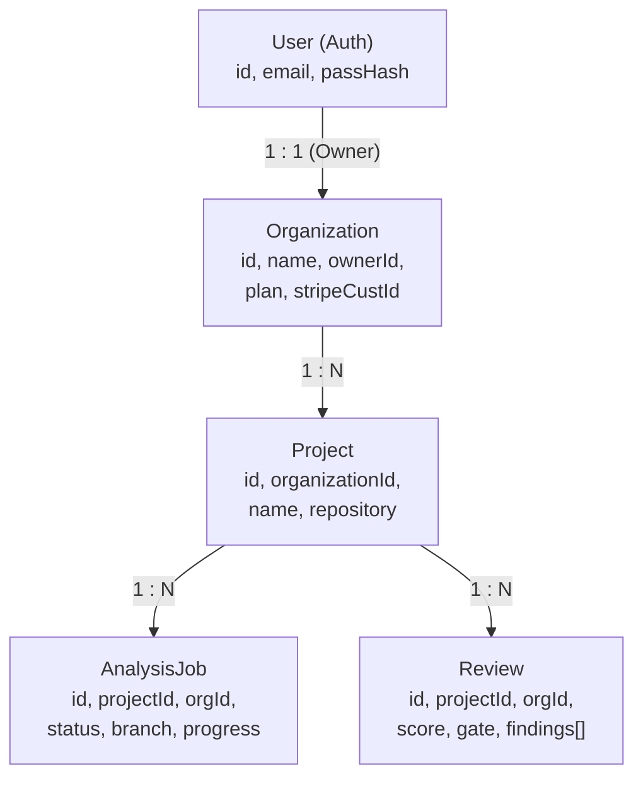

# QualityGuard — Multi-Tenancy & Authorization Audit

**Audit Scope:** Multi-Tenant Data Isolation, Entity Ownership Hierarchies, API Authorization Gates, and Cross-Tenant Leakage Prevention.  
**Auditor:** QualityGuard Principal Security & Data Architect  
**Classification:** Confirmed Strict Isolation / Production Grade

---

## 1. Domain Entity Hierarchy & Ownership



---

## 2. API Endpoint Authorization Matrix

Every private API endpoint verifies that the authenticated user belongs to the owning organization:

| Route | HTTP Method | Tenant Verification Rule | Cross-Tenant Response |
| :--- | :--- | :--- | :--- |
| `/me` | `GET` | Returns only caller's User, Org, and `store.listProjects(org.id)` | N/A |
| `/projects` | `GET` | Filtered by `organizationId === org.id` | Isolated list |
| `/projects` | `POST` | Forces `project.organizationId = org.id` | Allowed |
| `/projects/:id` | `GET` | `project.organizationId === org.id` | **HTTP 404** (Not Found) |
| `/projects/:id` | `DELETE` | `project.organizationId === org.id` | **HTTP 404** (Not Found) |
| `/projects/:id/analyses` | `POST` | `project.organizationId === org.id` | **HTTP 404** (Not Found) |
| `/projects/:id/analyses/latest` | `GET` | `project.organizationId === org.id` | **HTTP 404** (Not Found) |
| `/projects/:id/architecture` | `GET` | `project.organizationId === org.id` | **HTTP 404** (Not Found) |
| `/projects/:id/findings` | `GET` | `project.organizationId === org.id` | **HTTP 404** (Not Found) |
| `/projects/:id/security` | `GET` | `project.organizationId === org.id` | **HTTP 404** (Not Found) |
| `/projects/:id/dependencies` | `GET` | `project.organizationId === org.id` | **HTTP 404** (Not Found) |
| `/analyses` | `GET` | Filtered by `organizationId === org.id` | Isolated list |
| `/analyses/:id` | `GET` | `job.organizationId === org.id` or `review.organizationId === org.id` | **HTTP 404** (Not Found) |

> [!NOTE]
> QualityGuard uses **HTTP 404 (Not Found)** instead of HTTP 403 (Forbidden) for cross-tenant resource queries. This prevents unauthorized attackers from probing or enumerating valid entity IDs belonging to other organizations.

---

## 3. Database Layer Tenant Isolation

In PostgreSQL (`apps/api/src/db.ts`):
- `listProjects(orgId)`: `SELECT ... FROM projects WHERE organization_id = $1`
- `listRecentReviews(orgId, limit)`:
  ```sql
  SELECT r.* FROM reviews r
  INNER JOIN projects p ON p.id = r.project_id
  WHERE p.organization_id = $1
  ORDER BY r.created_at DESC LIMIT $2
  ```
- All foreign keys enforce `ON DELETE CASCADE` ensuring complete and clean deletion when an organization or project is removed.

---

## 4. Multi-Tenancy Verification & Tests

Verified in `apps/api/src/multitenancy.test.ts`:
- Tenant A registers and creates a project.
- Tenant B registers independently.
- Tenant B attempts to list, view, trigger analysis, view architecture, view security findings, view dependencies, and delete Tenant A's project.
- All 8 unauthorized operations are rejected with HTTP 404.
- Tenant A retains full and undisturbed access to all their data.
