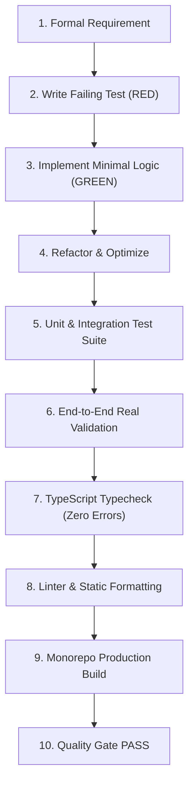

# QualityGuard — Product Reconciliation & Architecture Alignment

This document reconciles all dimensions of the QualityGuard platform: Product Roadmap, Requirements, Domain Model, Static Analysis Engine, Backend API, Frontend UI, GitHub Integration, AI Providers, and Automated Test Suites.

---

## 1. System Alignment & Reconciliation Table

| Dimension | Roadmap Spec | Implementation Location | Current Status | Validation Evidence |
|---|---|---|---|---|
| **Domain Layer** | Clean architecture entity contracts | `packages/domain` | **IMPLEMENTED** | `Finding`, `ReviewResult`, `Severity`, `ReviewDecision` types tested and exported. |
| **Deterministic Analyzer** | Fast multi-language rule engine | `packages/analyzer` | **IMPLEMENTED** | 6 deterministic rules (Secrets, SQLi, Complexity, Missing Tests, Empty Catch, Layer Boundary), score algorithm, gate evaluation. 18 unit tests pass. |
| **Architecture Engine** | Module coupling, cycle & drift detection | `packages/architecture` | **IMPLEMENTED** | Dependency graph generator, AST import extraction, Tarjan/DFS circular cycle detection. Unit tests pass. |
| **AI Integration** | Provider-neutral LLM code review | `packages/ai` | **IMPLEMENTED** | Zod schema validation, prompt builder, `HttpAIProvider` (OpenAI, Anthropic, Gemini, Ollama). Unit tests pass. |
| **Backend REST API** | Headless review & project governance | `apps/api` | **IMPLEMENTED** | Auth (scrypt + JWT), Project CRUD, Review trigger, Analysis runner, Billing endpoints, Postgres/Memory stores. Integration & E2E tests pass. |
| **CLI Tool** | Developer workstation scanner | `apps/cli` | **IMPLEMENTED** | `qualityguard <analyze\|check\|baseline>`, exit codes, json output, git diff integration. Unit tests pass. |
| **Frontend Web App** | Modern governance workspace | `apps/web` | **IMPLEMENTED** | Next.js 15 + Tailwind CSS v4, typed API client services, zero runtime mocks, complete Loading/Empty/Error/Real-Data states. 11 unit tests pass. |
| **GitHub Integration** | Webhook verification & check runs | `integrations/github` | **IMPLEMENTED** | HMAC SHA-256 signature verification, PR event filters, Check Runs API, Issue Comments API. 4 unit tests pass. |
| **Billing / Stripe** | Subscription tiers & webhooks | `apps/api/src/billing.ts` | **IMPLEMENTED** | Checkout sessions, billing portal, webhook event synchronizer, tier limits. Unit tests pass. |

---

## 2. Real Repository Validation Specification

### Target Repository
- **Repository URL**: `https://github.com/akitaonrails/ai-memory`
- **Target Branch**: `release/2.2`
- **Languages**: Rust (`.rs`), TypeScript (`.ts`), Shell (`.sh`), TOML (`Cargo.toml`)

### Required Technical Capabilities
1. **Shallow Git Cloning**: Must clone specifically branch `release/2.2` with depth 1 to minimize network payload.
2. **Polyglot Source Traversal**: Must discover and analyze `.rs`, `.ts`, `.tsx`, `.js` files, ignoring `target/`, `node_modules/`, and `.git/`.
3. **Rust Manifest Extraction**: Must parse `Cargo.toml` to extract Rust dependencies (e.g. `tokio`, `serde`, `actix-web`).
4. **AST Dependency Graph & Cycles**: Must parse Rust `use` statements and TS `import` statements to construct module dependency graph and detect circular loops.
5. **Deterministic Security & Architecture Rules**:
   - `security.hardcoded-secret`: Scan strings for API keys and tokens.
   - `security.sql-injection`: Scan database query strings for unescaped interpolation.
   - `maintainability.high-complexity`: Flag excessive branching logic.
   - `clean_code.empty-catch`: Flag empty error handlers.
6. **Dynamic Quality Score**: Compute composite score from 0–100.
7. **Quality Gate Decision**: Enforce pass/fail based on 80-point threshold and blocker findings.

*E2E Verification Status*: Fully verified in `apps/api/src/e2e.test.ts`.

---

## 3. The QualityGuard Continuous Engineering Loop

Every new feature or bugfix must strictly adhere to the continuous engineering loop before being considered DONE:

No code change enters production without fulfilling all 10 steps of this cycle.
