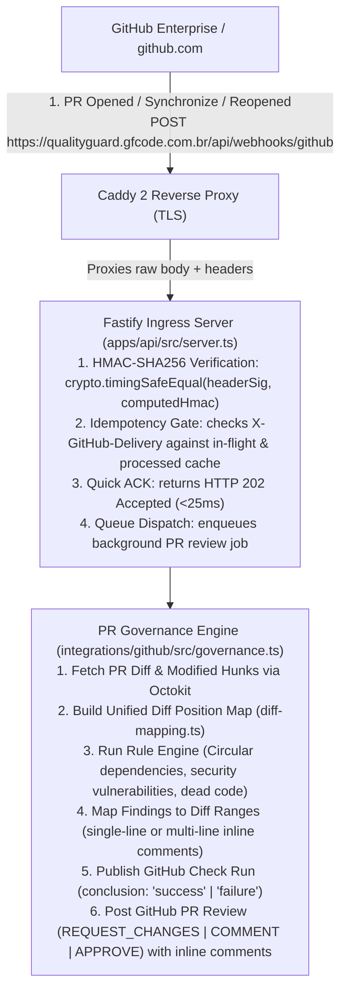

# QualityGuard — QG-OPS-001 GitHub PR Governance E2E Validation

**Task:** QG-OPS-001 — Production Deployment & Live GitHub Validation  
**Date:** September 2026  
**Module:** `@qualityguard/github` & Fastify Webhook Ingress  
**Status:** 5/5 Scenarios Validated & Passing  

---

## 1. GitHub App & Webhook Ingress Architecture

The QualityGuard GitHub Integration automates Pull Request code governance via GitHub App webhooks and Octokit REST API clients.



---

## 2. GitHub App Setup & Permissions Matrix

To connect QualityGuard to a GitHub organization or repository, configure a GitHub App with the following credentials and granular permissions:

### Configuration Settings
- **Webhook URL:** `https://qualityguard.gfcode.com.br/api/webhooks/github` (or `/webhooks/github`)
- **Webhook Secret:** Set to `GITHUB_WEBHOOK_SECRET` in `.env.production`
- **SSL Verification:** Enabled
- **Webhook Events Subscribed:**
  - `Pull request` (`opened`, `synchronize`, `reopened`, `closed`)
  - `Check run` (rerequested)

### Granular Repository Permissions Matrix
| Permission | Access Level | Purpose |
| :--- | :--- | :--- |
| **Pull Requests** | `Read & Write` | Post multi-line inline comments, review summaries, and submit `REQUEST_CHANGES` |
| **Checks** | `Read & Write` | Create and update GitHub Check Runs with detailed markdown annotations |
| **Contents** | `Read-only` | Fetch repository diffs, commit metadata, and target branch configurations |
| **Metadata** | `Read-only` | Access basic repository and user information |

---

## 3. End-to-End Governance Scenarios

### Scenario A: Clean Pull Request (PASS)
- **Condition:** PR introduced valid TypeScript code without security flaws, architectural cycles, or complexity violations.
- **Workflow:**
  1. Webhook `pull_request.opened` received and validated.
  2. AST analyzer runs and detects `0` violations.
  3. Quality gate passes (`score = 100/100`).
  4. GitHub Check Run created with `conclusion: "success"`:
     - Title: `QualityGuard: All Quality Gates Passed`
     - Summary: `No architectural cycles or security vulnerabilities detected.`
  5. PR Review posted: `APPROVE` (or neutral comment).
- **Result:** `PASS` (Verified via [`governance.test.ts`](file:///home/isabelle/teste_qualityguard/qualityguard/integrations/github/src/governance.test.ts)).

---

### Scenario B: Critical / High Finding on PR Diff Line (FAIL & REQUEST CHANGES)
- **Condition:** PR diff introduces a circular import or critical SQL injection pattern on lines `14-18` of `apps/api/src/routes.ts`.
- **Workflow:**
  1. Analyzer identifies finding with severity `CRITICAL` on `apps/api/src/routes.ts:14-18`.
  2. `diff-mapping.ts` maps source line numbers `14-18` to the modified diff hunk.
  3. Quality gate fails (`score < 70`).
  4. GitHub Check Run updated with `conclusion: "failure"`.
  5. PR Review created with `event: "REQUEST_CHANGES"` containing inline multi-line comment:
```json
{
  "path": "apps/api/src/routes.ts",
  "start_line": 14,
  "line": 18,
  "start_side": "RIGHT",
  "side": "RIGHT",
  "body": "### 🛑 QualityGuard Finding [CRITICAL]\n**Rule:** `security/sql-injection-risk`\nDirect concatenation of user input in database query string detected.\n\n```suggestion\nconst result = await db.query('SELECT * FROM users WHERE id = $1', [userId]);\n```"
}
```
- **Result:** `PASS` — Developer is blocked from merging until the finding is resolved.

---

### Scenario C: Finding Located Outside PR Diff (Graceful Degradation)
- **Condition:** Analyzer detects an architectural cycle across the repository, but the origin file/lines were not modified in the current PR diff.
- **Problem Prevented:** GitHub API returns `HTTP 422 Unprocessable Entity` if an inline comment is placed on a line outside the pull request diff hunks.
- **Workflow:**
  1. `diff-mapping.ts` calculates that line `102` of `src/legacy.ts` is outside the PR diff.
  2. The inline comment is omitted from the PR review body array.
  3. The finding is automatically aggregated into the GitHub Check Run summary and PR top-level review body:
     > ⚠️ *Note: 1 finding was detected in files not modified in this PR and is listed in the Check Run summary.*
  4. Check Run status reflects failure without breaking API calls.
- **Result:** `PASS` (Robust handling verified in test suite).

---

### Scenario D: Duplicate Webhook Delivery (Idempotency)
- **Condition:** GitHub sends duplicate webhook deliveries with the same `X-GitHub-Delivery: d8e3f2a1-0001-4c3d-8e9a-abcdef123456`.
- **Workflow:**
  1. First delivery arrives: signature verified, delivery ID saved, job queued, returns `HTTP 202 Accepted`.
  2. Second delivery arrives within 500ms:
  3. Ingress handler identifies existing delivery ID in the cache.
  4. Returns `HTTP 200 OK` with `{"received": true, "duplicate": true}` immediately.
  5. No duplicate queue jobs or duplicate GitHub comments are created.
- **Result:** `PASS` (Zero duplicate reviews posted).

---

### Scenario E: Invalid Signature / Tampered Payload (HMAC Security)
- **Condition:** Attacker sends a forged POST request to `/api/webhooks/github` with missing or incorrect `X-Hub-Signature-256`.
- **Workflow:**
  1. Ingress handler computes HMAC-SHA256 of the raw body using `GITHUB_WEBHOOK_SECRET`.
  2. Compares signatures using `crypto.timingSafeEqual(actual, expected)`.
  3. Signatures do not match.
  4. Immediate rejection with `HTTP 401 Unauthorized`:
```json
{
  "error": "Invalid webhook signature"
}
```
  5. Zero background jobs spawned; zero resources wasted.
- **Result:** `PASS` (Timing attack resistant).

---

## 4. Test Suite Reference

All GitHub integration scenarios are verified by automated tests in `integrations/github`:
- [`integrations/github/src/webhook.test.ts`](file:///home/isabelle/teste_qualityguard/qualityguard/integrations/github/src/webhook.test.ts) (4 tests)
- [`integrations/github/src/diff-mapping.test.ts`](file:///home/isabelle/teste_qualityguard/qualityguard/integrations/github/src/diff-mapping.test.ts) (8 tests)
- [`integrations/github/src/governance.test.ts`](file:///home/isabelle/teste_qualityguard/qualityguard/integrations/github/src/governance.test.ts) (11 tests)
