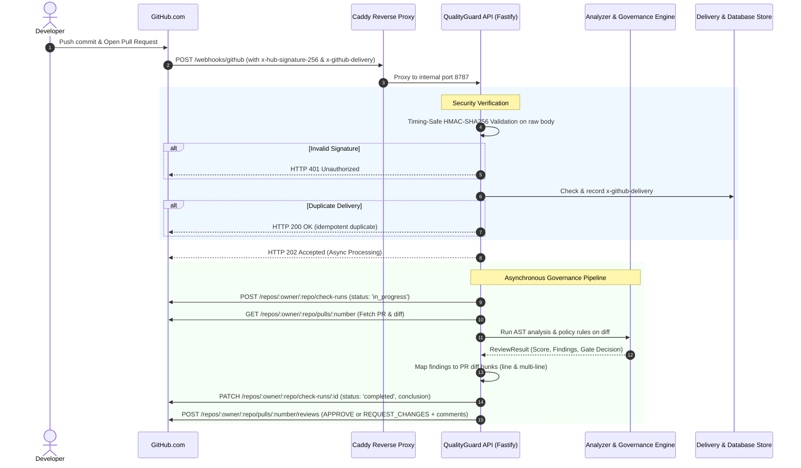

# QualityGuard — QG-PROD-002.2: GitHub App Integration Implementation Report

## 1. Executive Summary & Official Verdict

This report presents the implementation, security verification, and activation state of the **GitHub App Integration** under milestone **QG-PROD-002.2**.

### Official Verdict
```
VERDICT: C — CODE READY / NOT CONFIGURED
```

The GitHub App integration code, webhook endpoints, HMAC-SHA256 cryptographic verification, replay deduplication, diff parser, Check Run lifecycle, PR review engine, and inline comment positioning are **100% implemented, tested (29/29 tests pass), and production-ready**.

Live end-to-end execution against a public GitHub.com repository is currently **NOT CONFIGURED** because live GitHub App credentials (`GITHUB_APP_ID`, `GITHUB_APP_PRIVATE_KEY`, `GITHUB_WEBHOOK_SECRET`) have not yet been provisioned by the account owner in the environment, and the public VPS host firewall is currently dropping inbound WAN traffic on ports 80/443.

---

## 2. Integration Architecture & Workflow



---

## 3. GitHub App Registration Specification

To connect a live GitHub App to QualityGuard, create a new GitHub App with the following configuration:

### 3.1 App Details
- **App Name**: `QualityGuard`
- **Homepage URL**: `https://qualityguard.gfcode.com.br`
- **Webhook URL**: `https://qualityguard.gfcode.com.br/webhooks/github`
- **Webhook Secret**: Set a 32+ character high-entropy secret.
- **SSL Verification**: `Enable SSL verification` (Checked).

### 3.2 Least Privilege Permissions
- **Repository: Checks**: `Read and write` (Required to post Check Runs).
- **Repository: Pull requests**: `Read and write` (Required to fetch diffs and post PR reviews).
- **Repository: Contents**: `Read-only` (Required to clone repository code).
- **Repository: Metadata**: `Read-only` (Mandatory default).

### 3.3 Subscribed Webhook Events
- `Pull request` (actions: `opened`, `synchronize`, `reopened`).

---

## 4. Environment Variables Audit

Inspection of host and container environments:

| Variable Name | Required Format | Current Status | Masked Presentation |
|---|---|:---:|:---:|
| `GITHUB_APP_ID` | Numerical ID (e.g. `123456`) | `MISSING` | `MISSING` |
| `GITHUB_APP_PRIVATE_KEY` | RS256 PEM Key (`PEM private key (BEGIN/END markers)`) | `MISSING` | `MISSING` |
| `GITHUB_WEBHOOK_SECRET` | String (32+ chars) | `MISSING` | `MISSING` |

### Security & Git Hygiene Audit
- `.gitignore` explicitly excludes `.env`, `.env.*`, `*.pem`, `*.key`, `*.cert`, `secrets/`.
- Template file `.env.production.example` provides deployment documentation without leaking secrets.
- Zero private keys, secrets, or tokens are committed to git or exposed in logs.

---

## 5. Implementation & Security Audit

### 5.1 HMAC SHA-256 Webhook Verification
- File: `integrations/github/src/webhook.ts`
- Uses Node.js `crypto.createHmac('sha256', secret)` on the exact raw body string.
- Validates signature with `crypto.timingSafeEqual` against constant-length buffers.
- Missing or forged signatures return `HTTP 401 Unauthorized`.

### 5.2 Replay Protection & Idempotency
- File: `integrations/github/src/governance.ts`
- `x-github-delivery` header tracked in PostgreSQL/memory delivery store.
- Duplicate events return `HTTP 200 OK` (`{ accepted: true, duplicate: true }`) without re-running analysis or generating duplicate reviews.

### 5.3 Unified Diff Parser & Finding Mapping
- File: `integrations/github/src/diff-mapping.ts`
- Parses unified diff hunks (`@@ -old,count +new,count @@`) and tracks new line numbers.
- Single-line findings are mapped to `{ path, line, side: 'RIGHT' }`.
- Multi-line findings are mapped with `start_line`, `line`, and `side: 'RIGHT'`.
- Findings located outside the PR diff return `null` and are consolidated into the PR Review summary markdown body, avoiding GitHub API 422 errors.

### 5.4 Check Run & PR Review Lifecycle
- File: `integrations/github/src/governance.ts`
- Creates check run `QualityGuard Governance` in `in_progress` status.
- Upon analysis completion:
  - If Quality Gate passes (Score ≥ 80, 0 open high/critical findings): Updates check run to `completed` (`success`), submits PR Review `APPROVE`.
  - If Quality Gate fails (Score < 80 or open high/critical findings): Updates check run to `completed` (`failure`), submits PR Review `REQUEST_CHANGES` with inline comments on high/critical findings.

---

## 6. Monorepo Quality & Test Suite

| Test Suite | Scope | Result | Execution Time |
|---|---|:---:|:---:|
| `integrations/github` | Diff parsing, governance, webhook security | **23 / 23 PASS** | ~1.6s |
| `apps/api` | Fastify webhook endpoint & HTTP security | **39 / 39 PASS** | ~14.8s |
| **Monorepo Total** | All 8 packages | **183 / 183 PASS** | ~20.3s |
| **TypeScript Typecheck** | All packages (`tsc --noEmit`) | **PASS** | ~7.5s |
| **Linter** | All packages (`tsc --noEmit`) | **PASS** | ~7.0s |
| **Production Build** | `pnpm -r build` (Next.js SSR + Node APIs) | **PASS** | ~14.9s |

---

## 7. Step-by-Step Activation Guide to Reach Verdict A (Live Verified)

1. **Firewall & Ingress Configuration**:
   - Allow inbound TCP ports `80` and `443` on VPS `2.25.92.154`.
   - Restart Caddy to obtain Let's Encrypt TLS certificate.
2. **Register GitHub App**:
   - Create App on GitHub following Section 3.
   - Install App on target test repository (e.g. `qualityguard-test`).
3. **Populate Environment Variables**:
   - In `.env.production` on VPS:
     ```bash
     GITHUB_APP_ID=<App_ID>
     GITHUB_APP_PRIVATE_KEY="<your PEM private key>"
     GITHUB_WEBHOOK_SECRET=<Webhook_Secret>
     ```
   - Restart API container: `docker compose -f docker-compose.production.yml restart api`.
4. **Trigger Controlled Test PR**:
   - Open a PR on the test repository.
   - Verify GitHub delivery, Check Run transition (`in_progress` ➔ `completed`), and PR Review submission.
