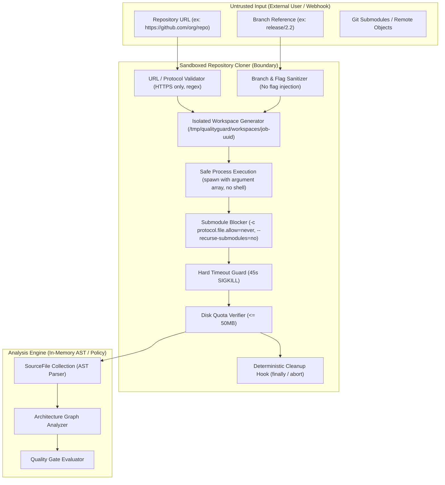

# QualityGuard — QG-TDD-002: Security Architecture & Threat Model

## 1. Visão Geral e Princípios de Segurança

O QualityGuard processa repositórios Git externos para realizar análise estática de código, detecção de complexidade ciclomática, inferência de grafos de arquitetura e avaliação de Quality Gates.

Qualquer repositório Git ou parâmetro fornecido pelo usuário (URL, branch, commit, conteúdo) é considerado **UNTRUSTED INPUT**. O cloner seguro (`SandboxedRepositoryCloner`) estabelece uma fronteira de isolamento estrita para mitigar riscos de segurança, ataques de negação de serviço e injeções de comando.

---

## 2. Threat Model (Modelo de Ameaças)



| Vetor de Ataque | Mecanismo de Exploração | Mitigação no QualityGuard |
| :--- | :--- | :--- |
| **Command Injection** | Metacaracteres de shell em URLs ou branches (`https://github.com/repo; rm -rf /`). | Rejeição estrita de metacaracteres (`;&\|\`$\n\r\t"'<>\0`) e execução direta de processo com array de argumentos (`spawn('git', args)`), sem passar por `sh` ou `bash`. |
| **Git Flag Injection** | Nomes de branch ou URLs que começam com `-` ou contêm flags como `--upload-pack=...` ou `--config=...`. | Rejeição de valores iniciados por `-`, validação regex estrita e uso do separador posicional `--` antes de URLs e caminhos de destino. |
| **Protocol Hijacking (SSRF / LFI)** | URLs usando protocolos perigosos (`file:///etc/passwd`, `ftp://`, `ssh://`, `javascript:`, `data:`). | Whitelist estrita de protocolo: apenas `https:` é permitido. Protocolos `file:` bloqueados explicitamente no Git via `-c protocol.file.allow=never`. |
| **Recursive Submodule Bomb** | Repositórios com submodules circulares ou apontando para arquivos locais sensíveis. | Clonagem com `--recurse-submodules=no`, `-c submodule.recurse=false` e `-c protocol.file.allow=never`. Submodules nunca são baixados ou inicializados. |
| **Overhead de Tags / Histórico** | Clonagem de tags pesadas e histórico completo de commits. | Clonagem shallow `--depth 1` e `--no-tags`. |
| **Negação de Serviço por Timeout (DoS)** | Conexões lentas ou repositórios que bloqueiam o clone indefinidamente. | Hard timeout de **45 segundos**. Em caso de estouro, o processo filho recebe `SIGKILL`, o diretório temporário é excluído e um `RepositoryCloneTimeoutError` tipado é lançado. |
| **Exaustão de Disco (Disk DoS)** | Repositórios massivos (> 500MB) que consomem todo o armazenamento do host. | Verificação de quota de disco com **limite máximo de 50 MB**. Se excedido, o workspace é excluído imediatamente e `RepositorySizeLimitError` é lançado (mapeado para `413 Payload Too Large`). |
| **Colisão e Vazamento de Workspaces** | Múltiplos jobs usando `/tmp/repo` ou deixando pastas órfãs após erros. | Cada job recebe um diretório exclusivo `/tmp/qualityguard/workspaces/job-<uuid>`. Bloco `finally` e tratadores de erro garantem exclusão imediata do workspace. |

---

## 3. Políticas de Validação e Limites Operacionais

1. **Protocolos Permitidos**:
   - `https://` (URLs completas validadas por parser estruturado)
   - Notação resumida `owner/repo` (automaticamente expandida para `https://github.com/owner/repo.git`)
2. **Branch Policy**:
   - Padrão regex: `^[a-zA-Z0-9_./-]+$`
   - Proibido início ou fim com `/` ou `.`, proibido sequências de path traversal `..`.
3. **Limites de Recursos**:
   - **Timeout de Clonagem**: 45.000 ms (45 segundos)
   - **Tamanho Máximo do Workspace**: 52.428.800 bytes (50 MB)
   - **Profundidade**: 1 commit (`--depth 1`)
   - **Tags**: Desabilitadas (`--no-tags`)
   - **Submodules**: Desabilitados (`--recurse-submodules=no`, `-c submodule.recurse=false`)

---

## 4. Lifecycle do Workspace Temporário

```typescript
const workspace = await cloner.clone({ repository, branch });
try {
  // Apenas leitura e AST parsing no diretório isolado
  const files = await collectFilesFromDir(workspace.path);
  // Análise estática pura
} finally {
  // Remoção recursiva forçada garantida
  await workspace.cleanup();
}
```

---

## 5. Limitações Conhecidas

- Repositórios privados exigindo autenticação SSH ou tokens privados necessitam de integração de credenciais OAuth/GitHub App (coberto em etapas subsequentes).
- Repositórios legítimos com código-fonte compactado acima de 50MB (ex: monorepos corporativos gigantes) exigirão plano enterprise com cotas estendidas.
