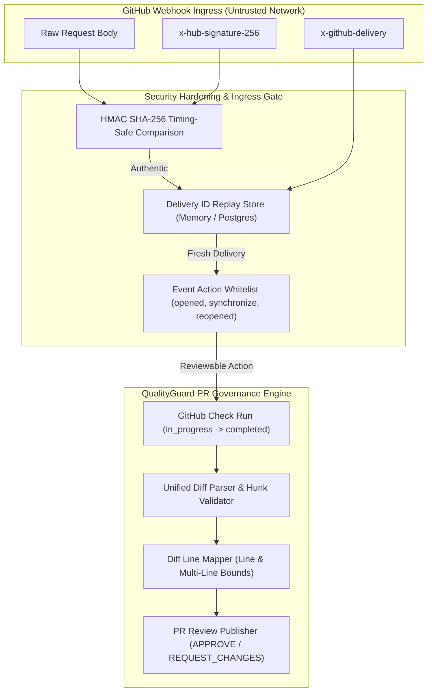

# QualityGuard — QG-TDD-003: GitHub PR Governance Security & Webhook Hardening

## 1. Visão Geral de Segurança

O QualityGuard atua como sentinela de governança de código em Pull Requests do GitHub. Para garantir que nenhuma requisição maliciosa ou replay de eventos comprometa a infraestrutura ou o processo de aprovação de código, a integração com o GitHub implementa uma fronteira de segurança multicamadas.

---

## 2. Threat Model (Modelo de Ameaças em Webhooks e PR Governance)



| Vetor de Ataque | Mecanismo de Exploração | Mitigação no QualityGuard (QG-TDD-003) |
| :--- | :--- | :--- |
| **Webhook Spoofing** | Requisições falsas fingindo ser o GitHub para disparar pipelines ou alterar status de gates. | Validação HMAC SHA-256 obrigatória sobre o **RAW REQUEST BODY** utilizando segredo compartilhado (`GITHUB_WEBHOOK_SECRET`) com comparação `timingSafeEqual`. |
| **Replay Attacks** | Reenvio de webhooks capturados para sobrecarregar a fila de análise (DoS) ou sobrescrever status válidos. | Rastreamento do identificador exclusivo `x-github-delivery`. Entregas já registradas são tratadas com idempotência, retornando `200/202` sem reprocessamento. |
| **Action Abuse / Event Pollution** | Envio de eventos não relacionados (ex: `closed`, `labeled`, `milestone`) para causar consumo de CPU/rede. | Filtro estrito de ações: apenas eventos `pull_request` com `action` em `['opened', 'synchronize', 'reopened']` avançam para análise. |
| **Invalid Comment Injection (API 422)** | Tentativa de publicar comentários inline em números de linha fora do diff do PR, causando falha na API do GitHub. | Algoritmo `mapFindingToDiffPosition` que valida se o finding e seus limites multi-linha pertencem a linhas adicionadas/modificadas (`+`) nos hunks do diff. Findings unmapped recebem fallback para o sumário do Check Run. |
| **Credential & Key Exposure** | Exposição de chaves privadas (`GITHUB_APP_PRIVATE_KEY`) ou tokens em logs de erro ou payloads da UI. | Geração de tokens de instalação de curta duração em memória; isolamento completo de chaves no backend e mensagens de erro sanitizadas. |

---

## 3. Especificações Técnicas de Segurança

### 3.1. Validação de Assinatura HMAC
- **Algoritmo**: HMAC com SHA-256 (`createHmac('sha256', secret)`).
- **Entrada**: Buffer bruto do corpo da requisição HTTP (`rawBody`).
- **Comparação**: `timingSafeEqual` para imunidade contra timing attacks.
- **Formato**: `sha256=<64_hex_chars>`.

### 3.2. Idempotência e Proteção contra Replay
- Todo webhook recebido contém o cabeçalho `x-github-delivery`.
- O método `store.recordWebhookDelivery(deliveryId)` é atômico em `MemoryStore` (Set) e `PostgresStore` (tabela de deliveries / cache).
- Resposta imediata `200 OK { accepted: true, duplicate: true }` para entregas repetidas.

### 3.3. Posicionamento de Comentários Inline (Diff Mapping)
- Comentários inline são enviados via `POST /repos/{owner}/{repo}/pulls/{number}/reviews`.
- Cada comentário é restrito a:
  ```json
  {
    "path": "src/auth.ts",
    "line": 12,
    "side": "RIGHT",
    "start_line": 10,
    "start_side": "RIGHT",
    "body": "### 🛡️ QualityGuard [CRITICAL] ..."
  }
  ```
- Apenas findings de severidade `critical` e `high` geram comentários inline para evitar poluição da interface do PR.

---

## 4. Lifecycle do Check Run e Avaliação de Gate

1. **Check Run Inicial**: `status: 'in_progress'` com `head_sha`.
2. **Execução de Governança**: Análise estática e Quality Gate.
3. **Decisão do Gate**:
   - `block` ou `critical`/`high` open findings ➔ Check Run `conclusion: 'failure'`, PR Review `event: 'REQUEST_CHANGES'`.
   - `review_required` ➔ Check Run `conclusion: 'neutral'`, PR Review `event: 'COMMENT'`.
   - `approve` ➔ Check Run `conclusion: 'success'`, PR Review `event: 'APPROVE'`.
