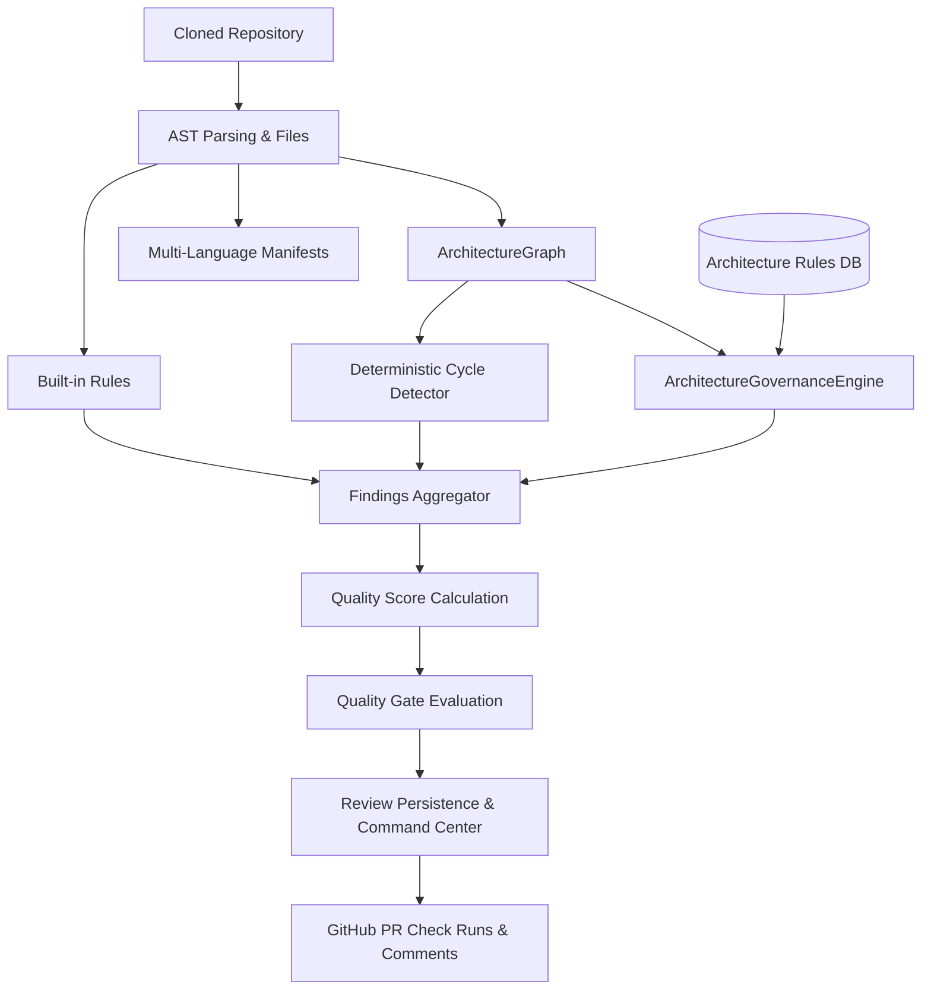

# QUALITYGUARD — QG-TDD-005 ARCHITECTURAL AUDIT
## Custom Architecture Governance Rule Engine

**Auditor:** Principal Software Architect  
**Date:** September 15, 2026  
**Status:** AUDIT COMPLETE — READY FOR IMPLEMENTATION  

---

## 1. Executive Summary

This audit establishes the architectural blueprint for **QG-TDD-005: Custom Architecture Governance Rule Engine**. The objective is to empower organizations and engineering teams to enforce deterministic, project-level architectural constraints (e.g. layer boundaries, forbidden dependencies, path isolation, directionality, and cycle enforcement) as first-class governance policies evaluated automatically during analysis and pull request reviews.

---

## 2. Current State Analysis

### 2.1 Domain & Analyzer Rules
- `@qualityguard/domain`: Defines standard `Finding` and `Severity` (`critical`, `high`, `medium`, `low`, `info`), `ReviewDecision` (`approve`, `review_required`, `block`), `FindingCategory` (including `'architecture'`), and `FindingSource` (`'deterministic'`).
- `@qualityguard/analyzer`:
  - `calculateScore`: Calculates scores with fixed deterministic penalties (`critical: 35`, `high: 20`, `medium: 10`, `low: 3`).
  - `evaluateGate`: Evaluates quality gate against minimum score and blocking severities (`critical`, `high`).
- `@qualityguard/architecture`:
  - `buildDependencyGraph(files)` extracts `ArchitectureGraph` (`{ nodes: string[], edges: DependencyEdge[] }`).
  - `findCycles(graph)` deterministically detects circular dependency cycles.
  - `detectDrift` provides a primitive prototype of policy drift.

### 2.2 Database & Persistence
- Postgres schema in `apps/api/migrations/001_initial.sql` manages `users`, `organizations`, `projects`, `reviews`, `usage_events`, `team_policies`.
- Storage interface `IStore` and implementations `MemoryStore` & `PostgresStore` handle CRUD for domain entities.
- Multi-tenancy isolation is strictly enforced via `organization_id` on projects and reviews.

### 2.3 Gaps to Bridge in QG-TDD-005
1. **No formal Architecture Rule Contract in Domain**: Need versioned `ArchitectureRule` and `ArchitectureRuleType` types in `@qualityguard/domain`.
2. **No Pure Architecture Governance Engine**: Need `evaluateArchitectureRules(graph, rules): Finding[]` in `@qualityguard/architecture`.
3. **No Database Persistence for Custom Rules**: Need `architecture_rules` table and migration with project/org foreign keys and indexes.
4. **No CRUD API Endpoints**: Need `/projects/:id/architecture-rules` endpoints with strict multi-tenant authentication.
5. **No Rule Builder UI**: Need rule builder interface in Settings and Governance overview in Architecture view.

---

## 3. Target Domain Contract & Schemas

### 3.1 Domain Contract (`@qualityguard/domain`)

```typescript
export type ArchitectureRuleType =
  | 'forbidden_dependency'
  | 'allowed_dependency'
  | 'forbidden_path_dependency'
  | 'no_cycles'
  | 'required_layer';

export interface ForbiddenDependencyConfig {
  source: string; // Glob pattern, e.g. "packages/ui/**" or "src/presentation/**"
  target: string; // Glob pattern, e.g. "packages/database/**" or "src/infrastructure/**"
}

export interface AllowedDependencyConfig {
  source: string; // Glob pattern, e.g. "frontend/**"
  allowedTargets: string[]; // Glob patterns, e.g. ["application/**", "shared/**"]
}

export interface ForbiddenPathDependencyConfig {
  fromPath: string; // Path prefix or glob, e.g. "src/presentation/**"
  toPath: string;   // Path prefix or glob, e.g. "src/infrastructure/**"
}

export interface NoCyclesConfig {
  maxCycleLength?: number; // Optional limit
}

export interface RequiredLayerConfig {
  layers: string[]; // Ordered list: e.g. ["ui", "application", "domain", "infrastructure"]
  strictAdjacentOnly?: boolean; // If true, layer i can only depend on layer i+1
}

export type ArchitectureRuleConfig =
  | ForbiddenDependencyConfig
  | AllowedDependencyConfig
  | ForbiddenPathDependencyConfig
  | NoCyclesConfig
  | RequiredLayerConfig
  | Record<string, unknown>;

export interface ArchitectureRule {
  id: string;
  projectId: string;
  organizationId: string;
  name: string;
  description?: string | undefined;
  enabled: boolean;
  severity: Severity;
  type: ArchitectureRuleType;
  config: ArchitectureRuleConfig;
  createdAt: string;
  updatedAt: string;
}
```

---

## 4. Rule Engine Specification

### 4.1 Safety & Security
- **No code execution**: Evaluation is 100% pure pattern matching over graph nodes/edges.
- **Glob & Path Matching**: Fast wildcard matching without exponential backtracking or ReDoS risk.
- **Deterministic output**: Findings sorted consistently by `ruleId`, `file`, and `title`.

### 4.2 Supported Rule Types

| Rule Type | Config Schema | Violation Condition | Generated Finding |
| :--- | :--- | :--- | :--- |
| `forbidden_dependency` | `{ source, target }` | Graph edge `e: from -> to` where `match(source, e.from)` and `match(target, e.to)`. | `ruleId: 'custom/forbidden-dependency'`, severity as configured. |
| `allowed_dependency` | `{ source, allowedTargets }` | Graph edge `e: from -> to` where `match(source, e.from)` and NOT `any(match(allowed, e.to))`. | `ruleId: 'custom/allowed-dependency'`, severity as configured. |
| `forbidden_path_dependency`| `{ fromPath, toPath }` | Graph edge `e: from -> to` where `match(fromPath, e.from)` and `match(toPath, e.to)`. | `ruleId: 'custom/forbidden-path-dependency'`, severity as configured. |
| `no_cycles` | `{ maxCycleLength? }` | Graph contains any circular dependency cycle. | `ruleId: 'custom/no-cycles'`, severity as configured. |
| `required_layer` | `{ layers, strictAdjacentOnly? }` | Dependency from layer $L_A$ to layer $L_B$ where index($L_B$) < index($L_A$) (backwards dependency) or violates adjacency. | `ruleId: 'custom/required-layer'`, severity as configured. |

---

## 5. Persistence & Multi-Tenancy Strategy

### 5.1 Database Schema (`architecture_rules`)

```sql
CREATE TABLE IF NOT EXISTS architecture_rules (
  id UUID PRIMARY KEY,
  project_id UUID NOT NULL REFERENCES projects(id) ON DELETE CASCADE,
  organization_id UUID NOT NULL REFERENCES organizations(id) ON DELETE CASCADE,
  name TEXT NOT NULL,
  description TEXT,
  enabled BOOLEAN NOT NULL DEFAULT true,
  severity TEXT NOT NULL DEFAULT 'high',
  type TEXT NOT NULL,
  config JSONB NOT NULL DEFAULT '{}',
  created_at TIMESTAMPTZ NOT NULL DEFAULT now(),
  updated_at TIMESTAMPTZ NOT NULL DEFAULT now()
);

CREATE INDEX IF NOT EXISTS architecture_rules_project_idx ON architecture_rules(project_id, enabled);
CREATE INDEX IF NOT EXISTS architecture_rules_org_idx ON architecture_rules(organization_id);
```

### 5.2 Multi-Tenant Isolation
- Project ownership check: Every CRUD operation verifies `project.organizationId === authenticatedUser.organizationId`.
- Cross-tenant requests return `404 Not Found`.

---

## 6. Pipeline Integration Flow



---

## 7. Implementation Plan (Strict TDD)

1. **Phase 1: Domain Contract**:
   - Define `ArchitectureRule`, `ArchitectureRuleType`, and configs in `@qualityguard/domain`.
   - Build `@qualityguard/domain`.
2. **Phase 2 & 3: Rule Engine & Test Suite (RED ➔ GREEN ➔ REFACTOR)**:
   - Create unit test suite `packages/architecture/src/engine.test.ts` covering all 17 unit test cases.
   - Implement `packages/architecture/src/engine.ts` with validation and pure evaluation.
   - Build `@qualityguard/architecture`.
3. **Phase 4 & 5: Persistence & Multi-Tenancy**:
   - Add `architecture_rules` table in `apps/api/migrations/001_initial.sql` / migration script.
   - Add `architecture_rules` store methods in `apps/api/src/store.ts` and `apps/api/src/db.ts`.
4. **Phase 6 & 7: API Endpoints & Integration Tests**:
   - Implement CRUD endpoints `/projects/:id/architecture-rules` in `apps/api/src/server.ts` & `apps/web/app/api/[...path]/route.ts`.
   - Add integration tests for CRUD, multi-tenant boundary, and quality gate impact in `apps/api/src/architecture-rules.test.ts`.
5. **Phase 8: Analysis Pipeline Integration**:
   - Update `runRepositoryAnalysis` in `apps/api/src/analysis.ts` and `apps/web/app/api/[...path]/route.ts` to evaluate custom rules.
6. **Phase 9: Frontend Governance Overview & Rule Builder**:
   - Add Governance Metrics & Status in Architecture Tab.
   - Add Rule Builder in Settings Tab.
   - Add Frontend tests in `apps/web/components/findings/findings.test.tsx` or new test file.
7. **Phase 10: Validation, Real E2E & Regression**:
   - Execute real test on `akitaonrails/ai-memory` with custom architecture rule.
   - Run `pnpm test`, `pnpm typecheck`, `pnpm lint`, `pnpm build`.
   - Write `docs/QG-TDD-005-IMPLEMENTATION-REPORT.md` and `docs/QG-TDD-005-RULE-SPEC.md`.
