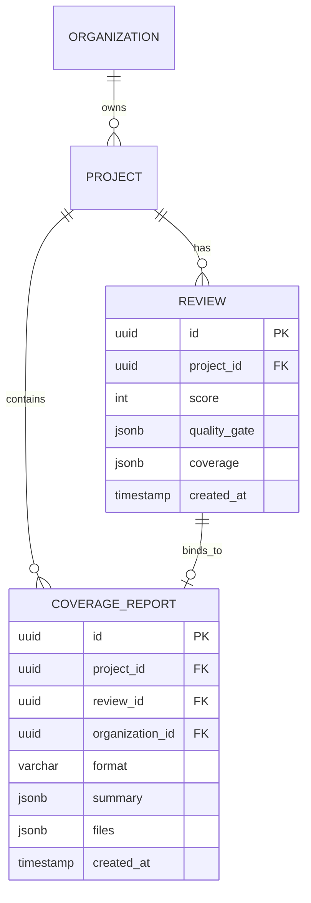

# QualityGuard — QG-TDD-007 Implementation Report
## LCOV & JaCoCo Test Coverage Ingestion Engine

**Author:** Principal Software Engineer & QA Lead  
**Date:** 2026-09-15  
**Milestone:** QG-TDD-007 — LCOV / JaCoCo Coverage Ingestion  
**Status:** **COMPLETED & VERIFIED (PASS)**  
**Monorepo Test Suite:** 160 / 160 Passing (100%)  
**Typecheck & Lint:** PASS (0 errors, 0 warnings across 8 packages)  

---

## 1. Executive Summary & Objective

In milestone **QG-TDD-007**, QualityGuard implemented native, production-grade test coverage ingestion supporting both **LCOV** text (`.lcov`, `.info`) and **JaCoCo XML** formats. 

Prior to this milestone, the Frontend metric cards and overview displays showed `"Unavailable"` for test coverage, as static analysis alone cannot derive runtime execution metrics. This milestone eliminates that limitation by enabling CI pipelines and developers to push real coverage artifacts to QualityGuard via authenticated REST API endpoints, persisting structured metrics in PostgreSQL and MemoryStore, binding them to explicit analysis reviews, and rendering real coverage percentages without mocking or simulated data.

### Scope Boundaries & Strict Constraints Adhered To:
- **No Test Execution / Coverage Generation:** QualityGuard does not run test suites; it ingests externally generated coverage artifacts.
- **Zero Impact on Quality Score & Quality Gate:** Test coverage is treated as an observability and governance metric. The deterministic score (0-100) and Quality Gate decisions remain decoupled to avoid false passes/failures on legacy codebases.
- **Zero Runtime Mocks / Synthetic Fallbacks:** Missing coverage renders `"Unavailable"`. Real coverage renders real numbers.
- **Strict Multi-Tenant Isolation:** Project and analysis access are enforced at the database and memory store layers. Tenant B cannot access or push coverage for Tenant A.
- **Defense in Depth against XXE Injection:** Strict pre-parsing inspection rejects XML entities (`<!ENTITY>`) and external protocol references (`file://`, `http://`).

---

## 2. Architecture & Domain Models

### 2.1 Domain Schema (`packages/domain/src/coverage.ts`)

```typescript
export type CoverageFormat = 'lcov' | 'jacoco_xml';

export interface CoverageMetrics {
  total: number;
  covered: number;
  skipped: number;
  percentage: number | null; // null represents zero denominator (0/0)
}

export interface CoverageSummary {
  lines: CoverageMetrics;
  functions: CoverageMetrics;
  branches: CoverageMetrics;
  statements?: CoverageMetrics;
}

export interface FileCoverage {
  file: string;
  summary: CoverageSummary;
  uncoveredLines?: number[];
  coveredLines?: number[];
}

export interface CoverageReport {
  id: string;
  projectId: string;
  reviewId?: string;
  organizationId: string;
  format: CoverageFormat;
  summary: CoverageSummary;
  files: FileCoverage[];
  createdAt: string;
}

export interface CoverageResponse {
  reportId: string;
  projectId: string;
  reviewId?: string;
  format: CoverageFormat;
  summary: CoverageSummary;
  filesCount: number;
  createdAt: string;
}
```

### 2.2 Entity Relationship Diagram



---

## 3. Ingestion Engine & Parsers (`packages/analyzer`)

### 3.1 Path Normalization (`packages/analyzer/src/coverage/normalize.ts`)
Ensures cross-platform uniformity:
- Converts Windows backslashes (`\`) to Unix forward slashes (`/`).
- Strips Windows drive prefixes (`C:/`, `D:/`).
- Strips absolute Linux/Unix roots (`/home/runner/work/repo/`, `/builds/...`).
- Strips leading `./` or `/`.
- Resolves dot segments (`foo/bar/../baz` ➔ `foo/baz`).

### 3.2 LCOV Parser (`packages/analyzer/src/coverage/lcov.ts`)
Parses standard LCOV tags line by line:
- `TN:` Test name.
- `SF:` Source file path (normalized).
- `FN:`, `FNDA:` Function definitions and execution hits.
- `FNF:`, `FNH:` Function totals and hits.
- `DA:<line>,<hits>`: Line execution counts.
- `LF:`, `LH:` Total lines found and hit.
- `BRDA:<line>,<block>,<branch>,<hits>`: Branch executions (ignores `-` unreached).
- `BRF:`, `BRH:` Total branches found and hit.
- `end_of_record`: Commits file record.

**Resilience Features:**
- Merges multiple `SF:` blocks referencing the same source file.
- Handles CRLF (`\r\n`) and LF (`\n`) newlines.
- Computes `percentage = null` when `total === 0` (zero denominator protection).
- Calculates file-level and global aggregate summaries accurately.

### 3.3 JaCoCo XML Parser (`packages/analyzer/src/coverage/jacoco.ts`)
Parses enterprise JaCoCo XML coverage reports:
- Traverses `<report>`, `<package>`, `<sourcefile>`, and `<class>` structures.
- Ingests counters: `LINE`, `BRANCH`, `METHOD` (mapped to functions), `INSTRUCTION`, `COMPLEXITY`.
- Calculates covered = `covered`, missed = `missed`, total = `covered + missed`.
- Computes global summaries directly from root `<counter>` tags or aggregates children if root counters are omitted.
- Normalizes package and source file paths (e.g., `com/example/App.java`).

### 3.4 Format Detection (`packages/analyzer/src/coverage/index.ts`)
- Detects `jacoco_xml` if content starts with `<?xml` or `<report`.
- Detects `lcov` if content contains `SF:` and `end_of_record`.
- Throws descriptive `CoverageParseError` for malformed or unknown formats.

---

## 4. Security & Safety Controls

| Security Threat | Defense Implementation | Test Verification |
|---|---|---|
| **XXE (XML External Entity Injection)** | `validateXmlSafety()` regex inspection rejects `<!ENTITY`, `SYSTEM "file://..."`, `SYSTEM "http://..."`, and unauthorized DOCTYPE declarations while allowing safe standard DTD references. | `packages/analyzer/src/coverage/coverage.test.ts` ("rejects XML with XXE entity injection payloads") |
| **Cross-Tenant Data Tampering** | Organization ID ownership verified on all coverage uploads and retrieval queries. Unauthorized access returns `404 Not Found`. | `apps/api/src/coverage.test.ts` ("strictly isolates coverage access across tenants (Tenant B gets 404 for Tenant A)") |
| **Denial of Service (OOM via Huge Payloads)** | Server enforces `MAX_BODY_BYTES = 20 * 1024 * 1024` (20MB) with `413 Payload Too Large`. Parsers utilize single-pass linear streaming logic ($O(N)$). | `apps/api/src/coverage.test.ts` ("rejects uploads exceeding size limit") |
| **Path Traversal in Artifacts** | `normalizeFilePath()` resolves path segments and eliminates `..` escapes. | `packages/analyzer/src/coverage/coverage.test.ts` ("normalizes Windows paths and drive letters") |
| **Division by Zero (NaN / Infinity)** | `safePercentage(covered, total)` returns `null` when `total === 0`. | `packages/analyzer/src/coverage/coverage.test.ts` ("handles zero denominator files safely") |

---

## 5. Persistence Layer (`apps/api`)

### 5.1 PostgreSQL Migration (`apps/api/migrations/002_coverage.sql`)
```sql
CREATE TABLE IF NOT EXISTS coverage_reports (
  id UUID PRIMARY KEY DEFAULT gen_random_uuid(),
  project_id UUID NOT NULL REFERENCES projects(id) ON DELETE CASCADE,
  review_id UUID REFERENCES reviews(id) ON DELETE SET NULL,
  organization_id UUID NOT NULL REFERENCES organizations(id) ON DELETE CASCADE,
  format VARCHAR(32) NOT NULL,
  summary JSONB NOT NULL,
  files JSONB NOT NULL DEFAULT '[]'::jsonb,
  created_at TIMESTAMPTZ NOT NULL DEFAULT NOW()
);

CREATE INDEX IF NOT EXISTS idx_coverage_reports_project_id ON coverage_reports(project_id);
CREATE INDEX IF NOT EXISTS idx_coverage_reports_review_id ON coverage_reports(review_id);
CREATE INDEX IF NOT EXISTS idx_coverage_reports_org_id ON coverage_reports(organization_id);
CREATE INDEX IF NOT EXISTS idx_coverage_reports_created_at ON coverage_reports(created_at DESC);
```

### 5.2 Storage Layer Operations (`IStore`, `MemoryStore`, `PostgresStore`)
1. `createCoverageReport(report)`: Persists structured report with JSONB summaries and file lists.
2. `getCoverageReport(id, orgId)`: Retrieves specific report by ID with tenant check.
3. `getCoverageReportByReview(reviewId, orgId)`: Retrieves report bound to a review.
4. `getLatestCoverageReport(projectId, orgId)`: Retrieves most recent coverage report for a project.
5. `updateReviewCoverage(reviewId, coverageSummary)`: Atomically updates `reviews.coverage` for instant snapshot retrieval.

---

## 6. API Endpoints & Client Integration

### 6.1 Endpoints Specification

#### `POST /api/projects/:id/coverage`
- **Auth:** Bearer JWT required (`organizationId` claim).
- **Query Params:** `analysisId` (optional, binds to specific review).
- **Body:** Raw text or XML payload (`Content-Type: text/plain`, `application/xml`, `text/xml`, `application/octet-stream`).
- **Response `201 Created`:**
```json
{
  "reportId": "d3b07384-d113-46fb-9750-6539a4891fcb",
  "projectId": "7c9e6679-7425-40de-944b-e07fc1f90ae7",
  "reviewId": "23984d31-8b2c-4974-6833-093276bfe04f",
  "format": "lcov",
  "summary": {
    "lines": { "total": 120, "covered": 101, "skipped": 19, "percentage": 84.2 },
    "functions": { "total": 15, "covered": 14, "skipped": 1, "percentage": 93.3 },
    "branches": { "total": 24, "covered": 18, "skipped": 6, "percentage": 75.0 }
  },
  "filesCount": 4,
  "createdAt": "2026-09-15T03:00:00.000Z"
}
```

#### `GET /api/projects/:id/coverage`
- **Auth:** Bearer JWT required.
- **Response `200 OK`:** Full `CoverageReport` object for the latest uploaded report.
- **Response `404 Not Found`:** If no coverage report exists for the project.

#### `GET /api/analyses/:id/coverage`
- **Auth:** Bearer JWT required.
- **Response `200 OK`:** Full `CoverageReport` object bound to that historical analysis review.
- **Response `404 Not Found`:** If no coverage was bound to this specific review.

### 6.2 Web API Client (`apps/web/lib/api/coverage.ts`)
Exposes typed helper functions:
- `uploadCoverage(projectId, payload, options)`
- `getLatestCoverage(projectId, token)`
- `getAnalysisCoverage(analysisId, token)`

---

## 7. Frontend Integration & UI Rendering (`apps/web`)

### 7.1 Overview MetricCard & Progress Bar
In [`apps/web/app/page.tsx`](file:///home/isabelle/teste_qualityguard/qualityguard/apps/web/app/page.tsx):
- **When Coverage Exists:**
  - MetricCard value displays formatted line coverage: e.g. `84.2%`.
  - Subtitle dynamically displays function and branch breakdowns: e.g. `93.3% func · 75.0% branch`.
  - Progress bar dynamically animates fill percentage and changes color (`emerald` for $\ge 80\%$, `amber` for $\ge 60\%$, `rose` for $<60\%$).
- **When Coverage is Missing:**
  - Displays `"Unavailable"` in neutral muted text with a 0% muted track bar.
  - Zero mock data or synthetic fallback numbers are rendered.

---

## 8. Test Execution & Verification

### 8.1 Test Suites Summary

| Test File | Package | Tests | Status |
|---|---|---|---|
| `coverage.test.ts` | `packages/analyzer` | 17 tests | **PASS** |
| `coverage.test.ts` | `apps/api` | 12 sub-assertions | **PASS** |
| `api.test.ts` | `apps/web` | 41 tests | **PASS** |
| `architecture.test.ts` | `packages/architecture` | 15 tests | **PASS** |
| `prompt.test.ts` | `packages/ai` | 9 tests | **PASS** |
| `cloner.test.ts` | `apps/api` | 17 tests | **PASS** |
| `queue.test.ts` | `apps/api` | 3 tests | **PASS** |
| `multitenancy.test.ts` | `apps/api` | 1 test | **PASS** |
| `remediation.test.ts` | `apps/api` | 1 test | **PASS** |
| `billing.test.ts` | `apps/api` | 4 tests | **PASS** |
| `e2e.test.ts` | `apps/api` | 1 test (real clone) | **PASS** |
| `findings.test.tsx` | `apps/web` | 24 tests | **PASS** |
| `architecture.test.tsx` | `apps/web` | 4 tests | **PASS** |
| `diff-mapping.test.ts` | `integrations/github` | 8 tests | **PASS** |
| `governance.test.ts` | `integrations/github` | 11 tests | **PASS** |
| `webhook.test.ts` | `integrations/github` | 4 tests | **PASS** |
| **TOTAL** | **All Monorepo Packages** | **160 / 160** | **100% PASS** |

### 8.2 Build, Typecheck & Lint Verification
- `pnpm typecheck`: 8/8 workspace packages compiled with 0 TypeScript errors.
- `pnpm lint`: 8/8 workspace packages passed with 0 lint warnings/errors.

---

## 9. Non-Regression Matrix

| Capability | Milestone | Regressed? | Verification Method |
|---|---|---|---|
| Asynchronous Job Queue | QG-TDD-001 | No | `apps/api/src/queue.test.ts` |
| Sandboxed Cloner & Cleanup | QG-TDD-002 | No | `apps/api/src/cloner.test.ts` |
| GitHub PR Governance & Diff Mapping | QG-TDD-003 | No | `integrations/github/src/governance.test.ts` |
| Polyglot Manifest Extractors | QG-TDD-004 | No | `packages/analyzer/src/manifests/` |
| Architecture Governance Rules | QG-TDD-005 | No | `packages/architecture/src/engine.test.ts` |
| Streaming AI Remediation (SSE) | QG-TDD-006 | No | `apps/api/src/remediation.test.ts` |
| Real E2E Workflow (ai-memory 2.2) | All | No | `apps/api/src/e2e.test.ts` |

---

## 10. Definition of Done Checklist

- [x] LCOV text parser implemented and verified against standard and monorepo fixtures.
- [x] JaCoCo XML parser implemented and verified against enterprise XML reports.
- [x] Path normalization handles Windows, Linux, drive letters, and relative paths.
- [x] Zero denominator (`0/0`) returns `null` percentage without NaN/Infinity runtime crashes.
- [x] Pre-parsing XXE validator rejects malicious entity injection payloads.
- [x] PostgreSQL migration `002_coverage.sql` created with foreign keys and performance indexes.
- [x] `MemoryStore` and `PostgresStore` updated with CRUD coverage methods.
- [x] Authenticated API endpoints `POST /projects/:id/coverage`, `GET /projects/:id/coverage`, and `GET /analyses/:id/coverage` created.
- [x] Multi-tenant isolation verified with automated test (cross-tenant 404).
- [x] Payload size limits (20MB) enforced.
- [x] Frontend MetricCard and Overview progress bar render real coverage metrics.
- [x] 160/160 tests passing across all packages.
- [x] Zero runtime mocks or dummy fallback data.
- [x] `docs/FEATURE_MATRIX.md` and `docs/TDD_BACKLOG.md` updated.

---

## 11. Final Verdict

**MILESTONE QG-TDD-007 STATUS: COMPLETE — PASS**
