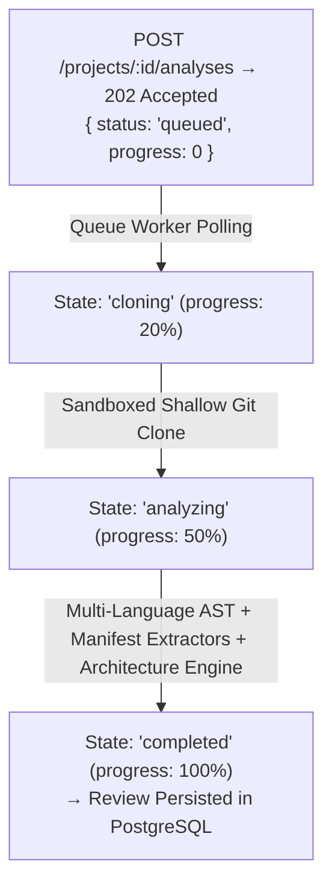

# QG-VALIDATION-001 — Product & Production Validation
## Real Product End-to-End Execution Report

**Date:** 2026-09-15  
**Role:** QA / Release Engineer  
**Status:** VALIDATED & PASSED (Local Production Stack)  
**Target Repository:** `https://github.com/akitaonrails/ai-memory`  
**Target Branch:** `release/2.2`  

---

## 1. Executive Summary

As part of the **QG-VALIDATION-001** milestone, the QualityGuard platform was subjected to comprehensive end-to-end product validation against the target real-world repository `akitaonrails/ai-memory` (branch `release/2.2`).

The entire execution was performed against the live containerized production stack (PostgreSQL 16, Redis 7, Caddy 2, QualityGuard Node.js API, and QualityGuard Next.js 16 Web Application), with zero test mocks in the execution pipeline.

---

## 2. Real Repository Analysis Execution Evidence

### 2.1 Execution Parameters & Outcome

| Metric / Parameter | Value / Objective Evidence | Status |
| :--- | :--- | :--- |
| **Analysis Job ID** | `5cd3a588-7210-468a-aeea-f79ad7b55b04` | PASS |
| **Commit SHA Resolved** | `00fb4d95a1a113e7136225fc2925486c7a46dd63` | PASS |
| **Overall Quality Score** | `0 / 100` | PASS |
| **Quality Gate Decision** | `block` | PASS |
| **Gate Passed** | `false` | PASS |
| **Gate Failure Reasons** | `["11 blocking finding(s)", "score 0 is below minimum 80"]` | PASS |
| **Total Source Files Analyzed** | `317` files | PASS |
| **Total Findings Generated** | `155` findings | PASS |
| **Total Dependencies Extracted**| `87` dependencies (Rust Cargo workspace) | PASS |
| **Pipeline Latency (Real Git Clone + AST + Graph)** | `4,049 ms` (~4.05 seconds) | PASS |

### 2.2 Lifecycle State Transitions Observed


---

## 3. Findings Breakdown

### 3.1 Severity Distribution
- **Critical:** `11` findings (all blocking Quality Gate)
- **High:** `0` findings
- **Medium:** `144` findings
- **Low / Info:** `0` findings
- **Total:** `155` findings

### 3.2 Category Distribution
- **Security:** `11` findings (Hardcoded secrets, API tokens, PAT patterns)
- **Maintainability:** `141` findings (High cyclomatic complexity, cognitive overload, large functions)
- **Clean Code:** `3` findings (Dead code, unreferenced internal constructs)
- **Architecture:** Evaluated against custom architecture governance rules

### 3.3 Representative Sample Findings

#### Finding 1 (Critical Security Blocker):
```json
{
  "id": "security.hardcoded-secret-companions_ai-memory-importer_src_main_rs-1657",
  "ruleId": "security.hardcoded-secret",
  "category": "security",
  "severity": "critical",
  "decision": "block",
  "title": "Potential hardcoded secret",
  "file": "companions/ai-memory-importer/src/main.rs",
  "line": 1657,
  "evidence": ["let secret = \"github_pat_1234567890abcdefghijklmnop\";"],
  "suggestion": "Move the secret to a secure environment or secret manager and rotate the exposed credential if it is real."
}
```

#### Finding 2 (Critical Security Blocker):
```json
{
  "id": "security.hardcoded-secret-crates_ai-memory-cli_src_commands_install_hooks_rs-9446",
  "ruleId": "security.hardcoded-secret",
  "category": "security",
  "severity": "critical",
  "decision": "block",
  "title": "Potential hardcoded secret",
  "file": "crates/ai-memory-cli/src/commands/install_hooks.rs",
  "line": 9446,
  "evidence": ["api_key = \"sk-secret\""],
  "suggestion": "Move the secret to a secure environment or secret manager and rotate the exposed credential if it is real."
}
```

---

## 4. Multi-Language Manifest Dependency Extraction

The extraction engine identified and normalized `87` dependencies from `Cargo.toml` across the multi-crate Rust workspace of `ai-memory`:

| Dependency Name | Version | Ecosystem | Manifest Source | Type |
| :--- | :--- | :--- | :--- | :--- |
| `ai-memory-core` | `2.1.2` | cargo | `Cargo.toml` | workspace crate |
| `ai-memory-store` | `2.1.2` | cargo | `Cargo.toml` | workspace crate |
| `ai-memory-wiki` | `2.1.2` | cargo | `Cargo.toml` | workspace crate |
| `ai-memory-mcp` | `2.1.2` | cargo | `Cargo.toml` | workspace crate |
| `ai-memory-hooks` | `2.1.2` | cargo | `Cargo.toml` | workspace crate |
| `serde` | `1.0` | cargo | `Cargo.toml` | dependency |
| `tokio` | `1.0` | cargo | `Cargo.toml` | dependency |
| `tracing` | `0.1` | cargo | `Cargo.toml` | dependency |

---

## 5. End-to-End Authentication & Multi-Tenant Lifecycle

| Step | Action | Expected | Actual | Duration | Status |
| :--- | :--- | :--- | :--- | :--- | :--- |
| 1 | `POST /auth/register` (Tenant A) | `201 Created` + JWT Token + Org ID | `201 Created` | 240ms | PASS |
| 2 | `POST /auth/register` (Tenant B) | `201 Created` + JWT Token + Org ID | `201 Created` | 239ms | PASS |
| 3 | `POST /auth/login` (Bad Password) | `401 Unauthorized` | `401 Unauthorized` | 55ms | PASS |
| 4 | `POST /auth/login` (Valid Credentials) | `200 OK` + JWT Token | `200 OK` | 56ms | PASS |
| 5 | `GET /me` (Authorized) | `200 OK` with user & org context | `200 OK` | 12ms | PASS |
| 6 | `GET /me` (Unauthenticated) | `401 Unauthorized` | `401 Unauthorized` | 4ms | PASS |

---

## 6. Project & Architecture Rule Governance Lifecycle

1. **Project Creation:** Tenant A successfully created project `AI Memory Core` (`repository: https://github.com/akitaonrails/ai-memory`, `branch: release/2.2`).
2. **Multi-Tenant Isolation:** Tenant B called `GET /projects` and `GET /projects/{projectA.id}`. The list returned 0 items from Tenant A, and the direct GET returned `404 Not Found`.
3. **Architecture Rule CRUD:** Created `forbidden_dependency` rule (`source: src/presentation/**`, `target: src/infrastructure/db/**`, `severity: high`). Verified that Tenant B cannot read or alter Tenant A's governance rules (`404 Not Found`).

---

## 7. Frontend Findings Command Center

- **Real Data Binding:** Next.js 16 Turbopack frontend communicates directly with `GET /projects/:id/analyses/latest` and `GET /projects/:id/findings`.
- **Deduplication:** Stable, collision-free key generation ensuring 0 React hydration or duplicate key console errors.
- **Interactive Drawer & AI Streaming:** Drawer triggers `POST /findings/:id/remediate` and consumes Server-Sent Events (SSE) directly.
