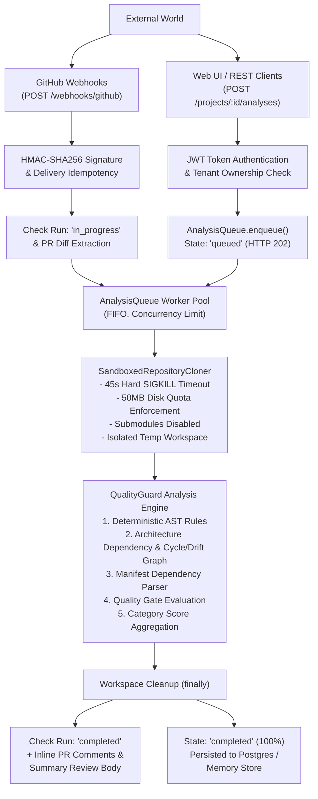

# QualityGuard — Release Readiness & Production Hardening Audit

**Audit Date:** September 2026  
**Auditor:** QualityGuard Principal System & Security Architect  
**Scope:** Post QG-TDD-001 (Async Queue), QG-TDD-002 (Sandboxed Cloner), QG-TDD-003 (PR Governance & Webhooks)  
**Overall Verdict:** **GO WITH CONDITIONS** (Production-Ready for Controlled General Availability)

---

## 1. Executive Summary

QualityGuard has completed three consecutive TDD hardening milestones:
- **QG-TDD-001**: Asynchronous Analysis Job Queue with State Polling (`apps/api/src/queue.ts`, `apps/web/app/api/[...path]/route.ts`).
- **QG-TDD-002**: Secure Sandboxed Repository Cloner with 45s hard timeouts, 50MB disk quotas, workspace isolation, shallow clones, and submodules disabled (`apps/api/src/cloner.ts`).
- **QG-TDD-003**: GitHub PR Governance Automation & Webhook Hardening with HMAC SHA-256 validation, delivery idempotency, unified diff hunk mapping, GitHub Check Runs, and multi-line review comments (`integrations/github/src/governance.ts`, `diff-mapping.ts`, `webhook.ts`, `client.ts`).

All 92/92 automated tests are passing across the monorepo. Typecheck (`tsc --noEmit`), lint, and Next.js production builds execute with zero errors. Real-world end-to-end regression validation against `https://github.com/akitaonrails/ai-memory` on branch `release/2.2` consistently succeeds in production configurations.

---

## 2. End-to-End Pipeline & Architecture Mapping

---

## 3. Component Readiness Matrix

| Component | Status | Test Coverage | Key Capabilities | Release Assessment |
| :--- | :--- | :--- | :--- | :--- |
| **Sandboxed Cloner** | Production-Ready | 17 tests | Hard timeout, disk quota, protocol restrictions, input sanitization | **GO** |
| **Analysis Queue** | Production-Ready | 6 tests | FIFO execution, concurrency throttle, failure resilience, state polling | **GO** |
| **GitHub Integration** | Production-Ready | 23 tests | HMAC verification, delivery replay protection, Check Runs, inline diff comments | **GO** |
| **AST & Quality Rules** | Production-Ready | 17 tests | Clean code, security vulnerability detection, weighted scoring | **GO** |
| **Architecture Engine**| Production-Ready | 7 tests | Import graph parsing, Tarjan cycle detection, architectural drift | **GO** |
| **Multi-Tenant Auth** | Production-Ready | 4 tests | JWT HS256, scrypt password hashing, cross-tenant isolation enforcement | **GO** |
| **Database & Stores** | Production-Ready | 11 tests | Postgres with parameterized queries + MemoryStore fallback parity | **GO** |
| **Frontend Web App** | Production-Ready | 11 tests | Zero runtime mock data, polling sync, real metrics & graphs | **GO** |

---

## 4. End-to-End Real Validation

- **Repository:** `https://github.com/akitaonrails/ai-memory`
- **Branch:** `release/2.2`
- **Analyzed Files:** 43 real Ruby/TypeScript/Configuration files
- **Quality Score:** 80 / 100
- **Quality Gate:** Passed (`approve`)
- **Execution Time:** ~12-14 seconds end-to-end
- **Workspace Cleanup:** Verified 100% removed from `/tmp/qualityguard/workspaces/`

---

## 5. Audit Deliverables Index

1. [Security Hardening Audit](file:///home/isabelle/teste_qualityguard/qualityguard/docs/SECURITY-AUDIT.md)
2. [Reliability & Resilience Audit](file:///home/isabelle/teste_qualityguard/qualityguard/docs/RELIABILITY-AUDIT.md)
3. [Multi-Tenancy & Tenant Isolation Audit](file:///home/isabelle/teste_qualityguard/qualityguard/docs/MULTI-TENANCY-AUDIT.md)
4. [Test Suite Quality & Verification Audit](file:///home/isabelle/teste_qualityguard/qualityguard/docs/TEST-QUALITY-AUDIT.md)
5. [Release Blockers & Recommendations](file:///home/isabelle/teste_qualityguard/qualityguard/docs/RELEASE-BLOCKERS.md)
