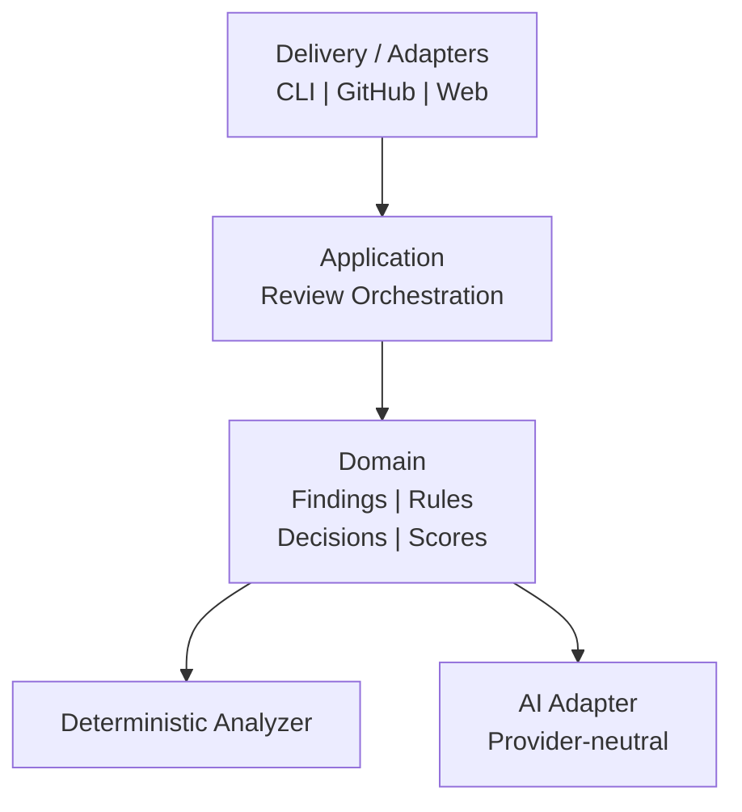
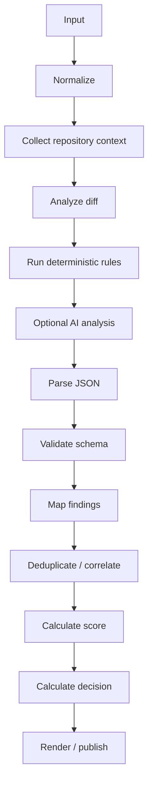
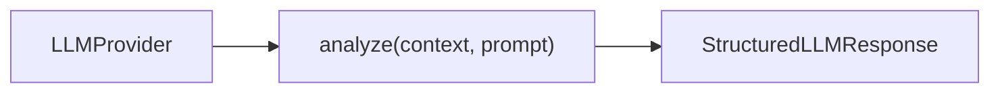
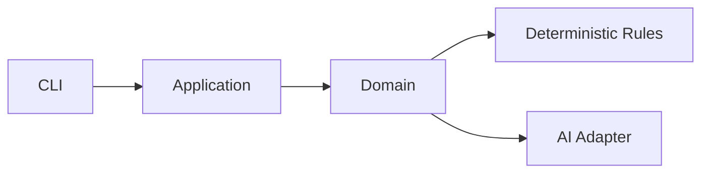
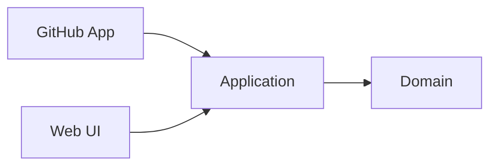
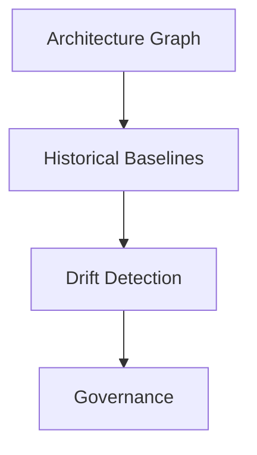

# Architecture

## Architectural direction

QualityGuard is organized as a layered analysis platform. The core domain must not depend on GitHub, an LLM provider, or a specific UI.

## Review pipeline

## Key constraint

The LLM is an analyzer, not the source of truth. It must return a strict machine-readable contract and all output must pass schema validation before entering the domain.

## Provider abstraction

The domain should depend on an interface such as:

Providers may include cloud or local models, but provider-specific code stays outside the domain.

## Security boundary

Repository content is sensitive. The architecture therefore treats source-code access as an explicit boundary. Future hosted deployments must support minimizing transmitted context and a local/self-hosted execution mode.

## Evolution path

MVP:

Then:

Later:

