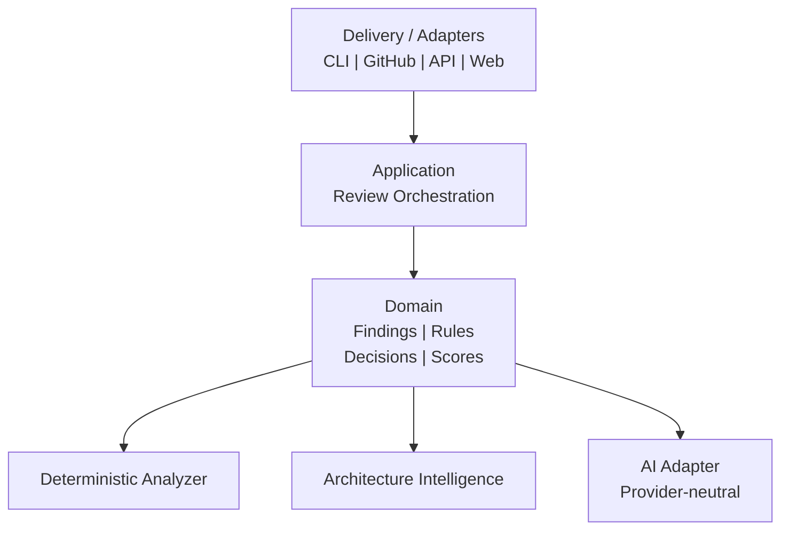
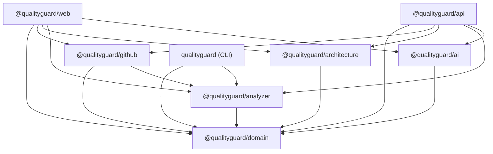
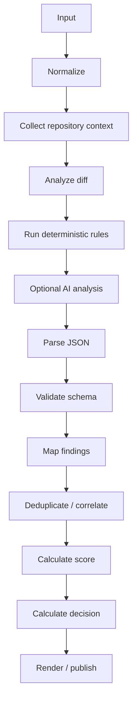
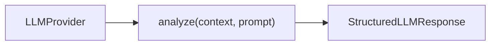
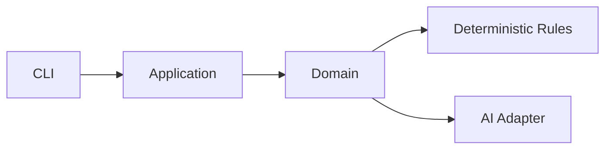
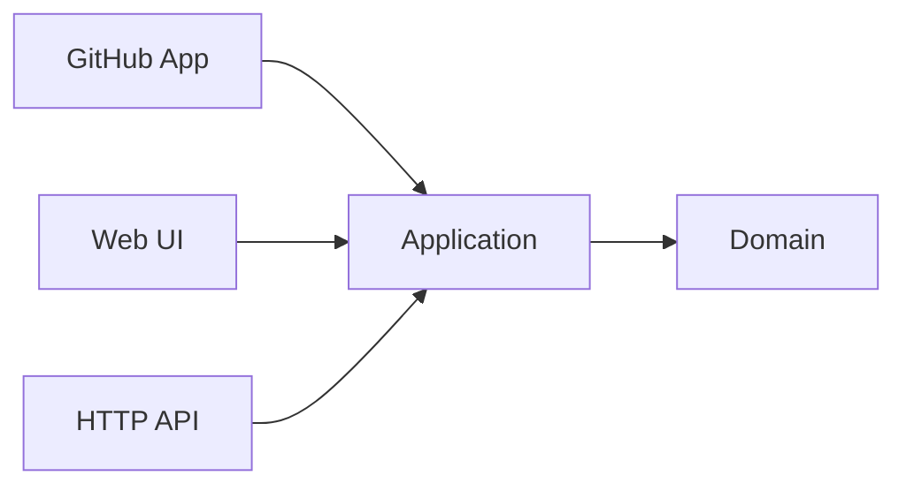
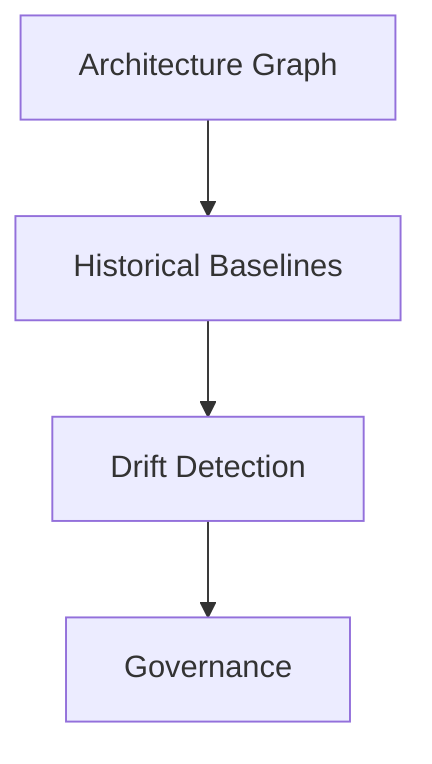

# Architecture

This document describes how QualityGuard is built. It reflects the current
codebase — the pnpm workspace, the dependency direction between packages, and
the review pipeline — followed by the design constraints that keep the system
extensible.

## Architectural direction

QualityGuard is a layered analysis platform. The core domain does not depend on
GitHub, an LLM provider, or a specific UI. Analysis capabilities depend on the
domain; delivery surfaces (CLI, GitHub, Web, API) compose those capabilities.

## Workspace layout

QualityGuard is a pnpm workspace monorepo (`apps/*`, `packages/*`,
`integrations/*`). Each package publishes under the `@qualityguard/*` scope.

| Package                    | Name                        | Role                                                         |
| -------------------------- | --------------------------- | ------------------------------------------------------------ |
| `packages/domain`          | `@qualityguard/domain`      | Shared domain types and the structured finding contract      |
| `packages/analyzer`        | `@qualityguard/analyzer`    | Deterministic rule engine, scoring, baseline, quality gate   |
| `packages/architecture`    | `@qualityguard/architecture`| AST extraction, dependency graph, architecture drift rules   |
| `packages/ai`              | `@qualityguard/ai`          | Provider abstraction for optional AI review                  |
| `integrations/github`      | `@qualityguard/github`      | Signed webhooks, GitHub App auth, PR diff + Check Run        |
| `apps/cli`                 | `qualityguard`              | Command-line interface                                       |
| `apps/api`                 | `@qualityguard/api`         | Backend HTTP API (Node.js, PostgreSQL)                       |
| `apps/web`                 | `@qualityguard/web`         | Next.js web application                                       |

## Dependency direction

Dependencies point inward. `domain` has no internal dependencies; everything
else depends on it, and delivery surfaces sit at the outermost layer. This is
enforced by the actual `package.json` dependency edges:

The rule this encodes: **no package may depend on a package in an outer layer.**
The domain never imports an analyzer, adapter, or delivery surface; adapters
never import each other except through the domain contract.

## Review pipeline

A review is a pipeline from raw input to a rendered decision. Deterministic
analysis runs first and always; AI analysis is optional and layered on top.

## Key constraint

The LLM is an analyzer, not the source of truth. It must return a strict
machine-readable contract, and all output passes schema validation (Zod) before
it enters the domain. A malformed or unvalidated AI response is discarded rather
than trusted — deterministic findings still stand on their own.

## Provider abstraction

The domain depends on a provider interface, not on any vendor SDK:

Adapters currently include OpenAI, Gemini, Anthropic, and Ollama. Cloud and
local models are interchangeable behind this interface, and provider-specific
code stays inside `@qualityguard/ai` — never in the domain.

## Security boundary

Repository content is sensitive, so source-code access is treated as an explicit
boundary. Two properties follow from this: hosted deployments minimize the
context transmitted to any external model, and a fully local/self-hosted
execution mode (deterministic engine plus a local Ollama model) requires no
third-party network calls.

## Evolution path

The layering is designed so delivery surfaces and long-horizon governance
features can be added without changing the core.

MVP — CLI over the engine:

Then — additional delivery surfaces on the same application core:

Later — governance built on accumulated architecture data:

